# ArXiv具身智能论文日报 - 2026年03月20日

本报告汇总了39篇具身智能相关的最新论文。

## 🏆 知名研究者论文

### 🌟 顶尖研究者

- 🌟 **NVIDIA**: **Jim Fan**

### ⭐️ 重要研究者

- ⭐️ **Peking University**: Shanghang Zhang, He Wang, He Wang, He Wang

## 📚 论文详情

### 1. RewardFlow: Topology-Aware Reward Propagation on State Graphs for Agentic RL with Large Language Models

**ArXiv ID**: 2603.18859v1
**作者**: Xiao Feng, Bo Han, Zhanke Zhou, 🌟 **Jim Fan** (NVIDIA), Jiangchao Yao, Ka Ho Li, Dahai Yu, Michael Kwok-Po Ng

**链接**: [PDF](https://arxiv.org/pdf/2603.18859v1) | [Abstract](https://arxiv.org/abs/2603.18859v1)

#### 📄 原文摘要

Reinforcement learning (RL) holds significant promise for enhancing the agentic reasoning capabilities of large language models (LLMs) with external environments. However, the inherent sparsity of terminal rewards hinders fine-grained, state-level optimization. Although process reward modeling offers a promising alternative, training dedicated reward models often entails substantial computational costs and scaling difficulties. To address these challenges, we introduce RewardFlow, a lightweight method for estimating state-level rewards tailored to agentic reasoning tasks. RewardFlow leverages the intrinsic topological structure of states within reasoning trajectories by constructing state graphs. This enables an analysis of state-wise contributions to success, followed by topology-aware graph propagation to quantify contributions and yield objective, state-level rewards. When integrated as dense rewards for RL optimization, RewardFlow substantially outperforms prior RL baselines across four agentic reasoning benchmarks, demonstrating superior performance, robustness, and training efficiency. The implementation of RewardFlow is publicly available at https://github.com/tmlr-group/RewardFlow.

#### 🌐 中文摘要

强化学习（RL）在增强大型语言模型（LLM）与外部环境的代理推理能力方面具有重要前景，但是，终端奖励固有的稀疏性阻碍了细粒度的状态级优化。尽管过程奖励建模提供了一种有前途的替代方案，但训练专用奖励模型通常需要大量的计算成本和扩展困难。为了应对这些挑战，我们引入了 RewardFlow，这是一种轻量级方法，用于估计针对代理推理任务量身定制的状态级奖励。 RewardFlow 通过构建状态图来利用推理轨迹内状态的内在拓扑结构。这使得能够分析州级对成功的贡献，然后进行拓扑感知图传播以量化贡献并产生客观的州级奖励。 当集成为 RL 优化的密集奖励时，RewardFlow 在四个代理推理基准上大大优于先前的 RL 基线，展示了卓越的性能、稳健性和训练效率。RewardFlow 的实现可在 https://github.com/tmlr-group/RewardFlow 上公开获得。

#### 🏗️ 核心架构

以下为论文中体现核心架构的关键图表：

**图 1: Page 2 Img 8**

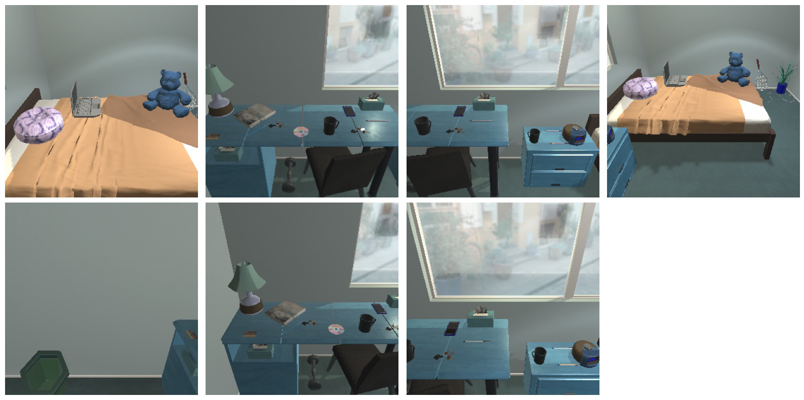

**图 2: Page 6 Img 1**

**图 3: Page 2 Img 4**

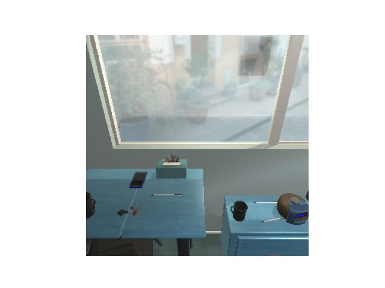

---

### 2. ProRL Agent: Rollout-as-a-Service for RL Training of Multi-Turn LLM Agents

**ArXiv ID**: 2603.18815v1
**作者**: Hao Zhang, Mingjie Liu, ⭐️ **Shanghang Zhang** (Peking University), Songyang Han, Jian Hu, Zhenghui Jin, Yuchi Zhang, Shizhe Diao, Ximing Lu, Binfeng Xu, Zhiding Yu, Jan Kautz, Yi Dong

**链接**: [PDF](https://arxiv.org/pdf/2603.18815v1) | [Abstract](https://arxiv.org/abs/2603.18815v1)

#### 📄 原文摘要

Multi-turn LLM agents are increasingly important for solving complex, interactive tasks, and reinforcement learning (RL) is a key ingredient for improving their long-horizon behavior. However, RL training requires generating large numbers of sandboxed rollout trajectories, and existing infrastructures often couple rollout orchestration with the training loop, making systems hard to migrate and maintain. Under the rollout-as-a-service philosophy, we present ProRL Agent , a scalable infrastructure that serves the full agentic rollout lifecycle through an API service. ProRL Agent also provides standardized and extensible sandbox environments that support diverse agentic tasks in rootless HPC settings. We validate ProRL Agent through RL training on software engineering, math, STEM, and coding tasks. ProRL Agent is open-sourced and integrated as part of NVIDIA NeMo Gym.

#### 🌐 中文摘要

多回合 LLM 智能体对于解决复杂的交互式任务越来越重要，而强化学习 (RL) 是改善其长期行为的关键因素。然而，强化学习训练需要生成大量沙盒转出轨迹，而现有基础设施通常将转出编排与训练循环结合在一起，导致系统难以迁移和维护。在推出即服务理念下，我们推出了 ProRL Agent，这是一种可扩展的基础设施，通过 API 服务为完整的代理推出生命周期提供服务。 ProRL Agent 还提供标准化和可扩展的沙箱环境，支持无根 HPC 设置中的各种代理任务。我们通过软件工程、数学、STEM 和编码任务的 RL 培训来验证 ProRL Agent。 ProRL Agent 是开源的，并集成为 NVIDIA NeMo Gym 的一部分。

#### 🏗️ 核心架构

以下为论文中体现核心架构的关键图表：

**图 1: Page 1 Img 1**

---

### 3. CausalRM: Causal-Theoretic Reward Modeling for RLHF from Observational User Feedbacks

**ArXiv ID**: 2603.18736v1
**作者**: ⭐️ **He Wang** (Peking University), Licheng Pan, Zhichao Chen, Chunyuan Zheng, Zhixuan Chu, Xiaoxi Li, Yuan Lu, Xinggao Liu, Haoxuan Li, Zhouchen Lin

**链接**: [PDF](https://arxiv.org/pdf/2603.18736v1) | [Abstract](https://arxiv.org/abs/2603.18736v1)

#### 📄 原文摘要

Despite the success of reinforcement learning from human feedback (RLHF) in aligning language models, current reward modeling heavily relies on experimental feedback data collected from human annotators under controlled and costly conditions. In this work, we introduce observational reward modeling -- learning reward models with observational user feedback (e.g., clicks, copies, and upvotes) -- as a scalable and cost-effective alternative. We identify two fundamental challenges in this setting: (1) observational feedback is noisy due to annotation errors, which deviates it from true user preference; (2) observational feedback is biased by user preference, where users preferentially provide feedback on responses they feel strongly about, which creats a distribution shift between training and inference data. To address these challenges, we propose CausalRM, a causal-theoretic reward modeling framework that aims to learn unbiased reward models from observational feedback. To tackle challenge (1), CausalRM introduces a noise-aware surrogate loss term that is provably equivalent to the primal loss under noise-free conditions by explicitly modeling the annotation error generation process. To tackle challenge (2), CausalRM uses propensity scores -- the probability of a user providing feedback for a given response -- to reweight training samples, yielding a loss function that eliminates user preference bias. Extensive experiments across diverse LLM backbones and benchmark datasets validate that CausalRM effectively learns accurate reward signals from noisy and biased observational feedback and delivers substantial performance improvements on downstream RLHF tasks -- including a 49.2% gain on WildGuardMix and a 32.7% improvement on HarmBench. Code is available on our project website.

#### 🌐 中文摘要

尽管基于人类反馈的强化学习（RLHF）在调整语言模型方面取得了成功，但当前的奖励建模严重依赖于在受控和昂贵的条件下从人类注释者收集的实验反馈数据。在这项工作中，我们引入了观察性奖励模型——利用观察性用户反馈（例如点击、复制和点赞）学习奖励模型——作为一种可扩展且经济高效的替代方案。我们在此设置中确定了两个基本挑战：（1）由于注释错误，观察反馈存在噪音，这偏离了真实的用户偏好； (2) 观察反馈因用户偏好而存在偏差，用户优先针对他们强烈感受的响应提供反馈，这会造成训练数据和推理数据之间的分布变化。为了应对这些挑战，我们提出了 CausalRM，一种因果理论奖励建模框架，旨在从观察反馈中学习无偏见的奖励模型。 为了应对挑战 (1)，CausalRM 引入了一个噪声感知替代损失项，通过对注释错误生成过程进行显式建模，可证明该替代损失项等效于无噪声条件下的原始损失。为了应对挑战 (2)，CausalRM 使用倾向得分（用户为给定响应提供反馈的概率）来重新加权训练样本，产生消除用户偏好偏差的损失函数。跨不同 LLM 主干和基准数据集的广泛实验验证了 CausalRM 可以有效地从噪声和有偏差的观察反馈中学习准确的奖励信号，并为下游 RLHF 任务带来显着的性能改进，包括在 WildGuardMix 上提高 49.2%，在 HarmBench 上提高 32.7%。代码可在我们的项目网站上找到。

---

### 4. CSSDF-Net: Safe Motion Planning Based on Neural Implicit Representations of Configuration Space Distance Field

**ArXiv ID**: 2603.18669v1
**作者**: Haohua Chen, Yixuan Zhou, Yifan Zhou, ⭐️ **He Wang** (Peking University)

**链接**: [PDF](https://arxiv.org/pdf/2603.18669v1) | [Abstract](https://arxiv.org/abs/2603.18669v1)

#### 📄 原文摘要

High-dimensional manipulator operation in unstructured environments requires a differentiable, scene-agnostic distance query mechanism to guide safe motion generation. Existing geometric collision checkers are typically non-differentiable, while workspace-based implicit distance models are hindered by the highly nonlinear workspace--configuration mapping and often suffer from poor convergence; moreover, self-collision and environment collision are commonly handled as separate constraints. We propose Configuration-Space Signed Distance Field-Net (CSSDF-Net), which learns a continuous signed distance field directly in configuration space to provide joint-space distance and gradient queries under a unified geometric notion of safety. To enable zero-shot generalization without environment-specific retraining, we introduce a spatial-hashing-based data generation pipeline that encodes robot-centric geometric priors and supports efficient retrieval of risk configurations for arbitrary obstacle point sets. The learned distance field is integrated into safety-constrained trajectory optimization and receding-horizon MPC, enabling both offline planning and online reactive avoidance. Experiments on a planar arm and a 7-DoF manipulator demonstrate stable gradients, effective collision avoidance in static and dynamic scenes, and practical inference latency for large-scale point-cloud queries, supporting deployment in previously unseen environments.

#### 🌐 中文摘要

非结构化环境中的高维机械臂操作需要可微分、与场景无关的距离查询机制来指导安全运动生成。现有的几何碰撞检查器通常是不可微分的，而基于工作空间的隐式距离模型受到高度非线性工作空间配置映射的阻碍，并且经常会遇到收敛性差的问题；此外，自碰撞和环境碰撞通常作为单独的约束来处理。我们提出了配置空间有符号距离场网络（CSSDF-Net），它直接在配置空间中学习连续的有符号距离场，以在统一的安全几何概念下提供联合空间距离和梯度查询。 为了在无需特定环境再训练的情况下实现零样本泛化，我们引入了一种基于空间哈希的数据生成管道，该管道对以机器人为中心的几何先验进行编码，并支持对任意障碍点集的风险配置进行高效检索。学习到的距离场被集成到安全约束轨迹优化和后退视野 MPC 中，从而实现离线规划和在线反应性规避。平面手臂和 7-DoF 机械臂上的实验证明了稳定的梯度、静态和动态场景中的有效碰撞避免以及大规模点云查询的实用推理延迟，支持在以前未见过的环境中进行部署。

#### 🏗️ 核心架构

以下为论文中体现核心架构的关键图表：

**图 1: Page 7 Img 2**

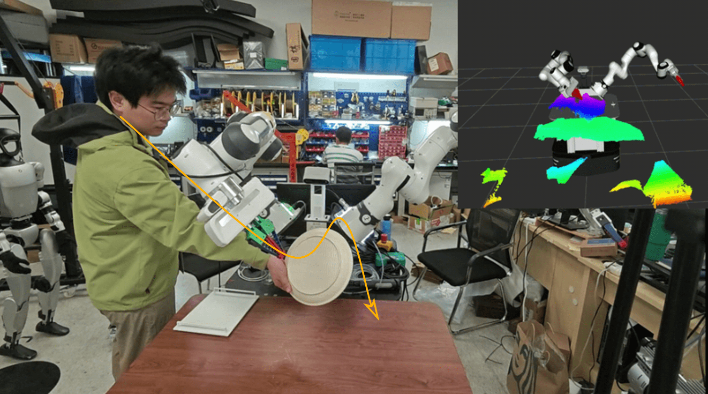

**图 2: Page 7 Img 1**

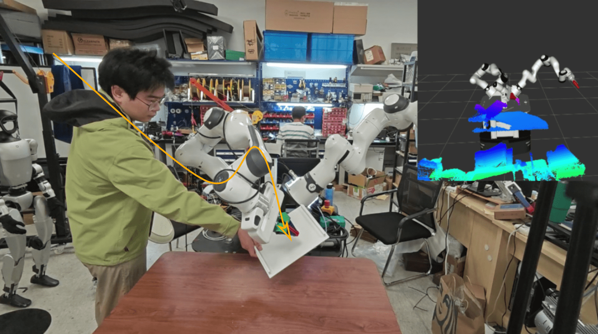

**图 3: Page 7 Img 3**

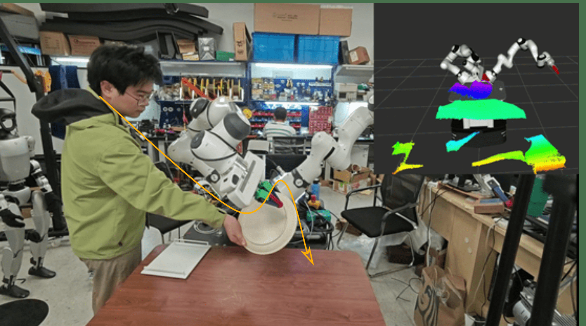

---

### 5. Efficient and Versatile Quadrupedal Skating: Optimal Co-design via Reinforcement Learning and Bayesian Optimization

**ArXiv ID**: 2603.18408v1
**作者**: ⭐️ **He Wang** (Peking University), Zhenlong Fang, Josiah Hanna, Xiaobin Xiong

**链接**: [PDF](https://arxiv.org/pdf/2603.18408v1) | [Abstract](https://arxiv.org/abs/2603.18408v1)

#### 📄 原文摘要

In this paper, we present a hardware-control co-design approach that enables efficient and versatile roller skating on quadrupedal robots equipped with passive wheels. Passive-wheel skating reduces leg inertia and improves energy efficiency, particularly at high speeds. However, the absence of direct wheel actuation tightly couples mechanical design and control. To unlock the full potential of this modality, we formulate a bilevel optimization framework: an upper-level Bayesian Optimization searches the mechanical design space, while a lower-level Reinforcement Learning trains a motor control policy for each candidate design. The resulting design-policy pairs not only outperform human-engineered baselines, but also exhibit versatile behaviors such as hockey stop (rapid braking by turning sideways to maximize friction) and self-aligning motion (automatic reorientation to improve energy efficiency in the direction of travel), offering the first system-level study of dynamic skating motion on quadrupedal robots.

#### 🌐 中文摘要

在本文中，我们提出了一种硬件控制协同设计方法，可在配备被动轮的四足机器人上实现高效且多功能的轮滑。被动轮滑冰可减少腿部惯性并提高能源效率，特别是在高速时。然而，由于缺乏直接的车轮致动，机械设计和控制紧密耦合。为了释放这种模式的全部潜力，我们制定了一个双层优化框架：上层贝叶斯优化搜索机械设计空间，而下层强化学习为每个候选设计训练电机控制策略。 由此产生的设计策略对不仅优于人类设计的基线，而且还表现出多种行为，例如曲棍球停止（通过侧向转动以最大化摩擦力来快速制动）和自对准运动（自动重新定向以提高行进方向的能量效率），提供了第一个关于四足机器人动态滑冰运动的系统级研究。

#### 🏗️ 核心架构

以下为论文中体现核心架构的关键图表：

**图 1: Page 6 Img 7**

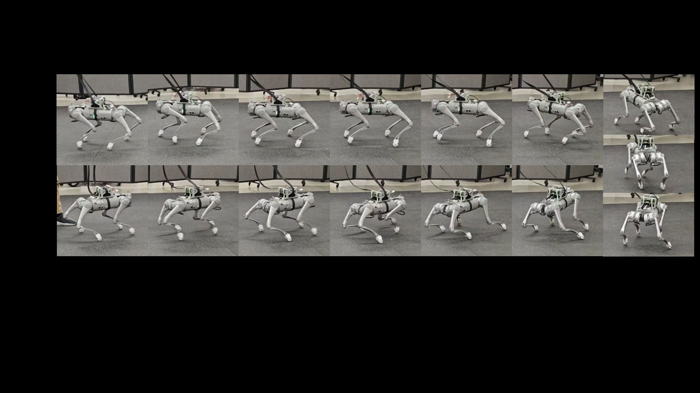

**图 2: Page 3 Img 3**

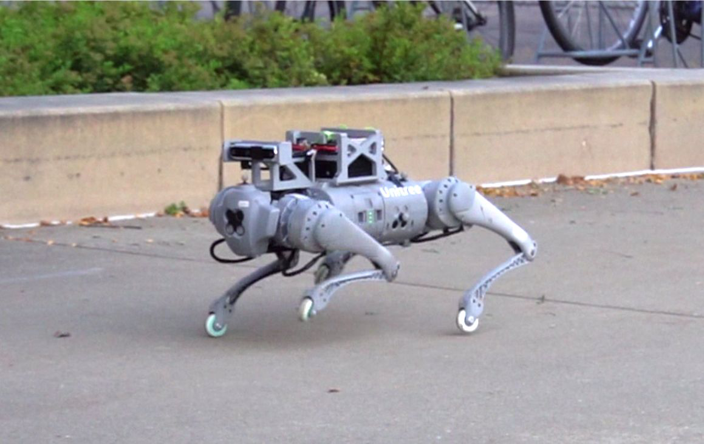

**图 3: Page 6 Img 2**

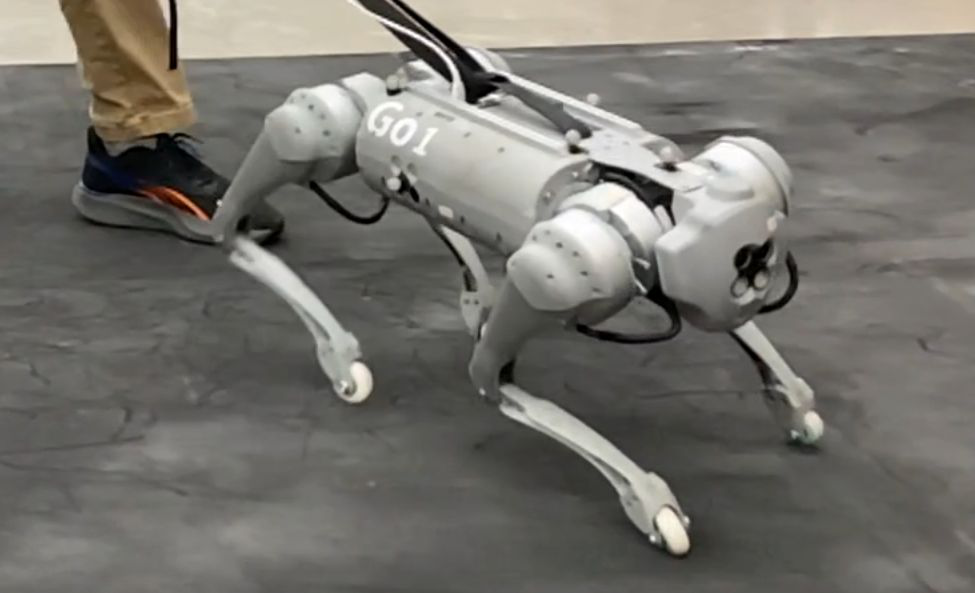

---

### 6. MultihopSpatial: Multi-hop Compositional Spatial Reasoning Benchmark for Vision-Language Model

**ArXiv ID**: 2603.18892v1
**作者**: Youngwan Lee, Soojin Jang, Yoorhim Cho, Seunghwan Lee, Yong-Ju Lee, Sung Ju Hwang

**链接**: [PDF](https://arxiv.org/pdf/2603.18892v1) | [Abstract](https://arxiv.org/abs/2603.18892v1)

#### 📄 原文摘要

Spatial reasoning is foundational for Vision-Language Models (VLMs), particularly when deployed as Vision-Language-Action (VLA) agents in physical environments. However, existing benchmarks predominantly focus on elementary, single-hop relations, neglecting the multi-hop compositional reasoning and precise visual grounding essential for real-world scenarios. To address this, we introduce MultihopSpatial, offering three key contributions: (1) A comprehensive benchmark designed for multi-hop and compositional spatial reasoning, featuring 1- to 3-hop complex queries across diverse spatial perspectives. (2) Acc@50IoU, a complementary metric that simultaneously evaluates reasoning and visual grounding by requiring both answer selection and precise bounding box prediction - capabilities vital for robust VLA deployment. (3) MultihopSpatial-Train, a dedicated large-scale training corpus to foster spatial intelligence. Extensive evaluation of 37 state-of-the-art VLMs yields eight key insights, revealing that compositional spatial reasoning remains a formidable challenge. Finally, we demonstrate that reinforcement learning post-training on our corpus enhances both intrinsic VLM spatial reasoning and downstream embodied manipulation performance.

#### 🌐 中文摘要

空间推理是视觉语言模型 (VLM) 的基础，特别是在物理环境中部署为视觉语言动作 (VLA) 代理时。然而，现有基准主要关注基本的单跳关系，忽略了现实世界场景所必需的多跳组合推理和精确的视觉基础。为了解决这个问题，我们引入了 MultihopSpatial，它提供了三个关键贡献：(1) 专为多跳和组合空间推理而设计的综合基准，具有跨不同空间视角的 1 到 3 跳复杂查询。 (2) Acc@50IoU，一种补充指标，通过要求答案选择和精确的边界框预测来同时评估推理和视觉基础——这对于稳健的 VLA 部署至关重要。 (3) MultihopSpatial-Train，一个专门用于培养空间智能的大规模训练语料库。 对 37 个最先进的 VLM 的广泛评估产生了八个关键见解，揭示了组合空间推理仍然是一个艰巨的挑战。最后，我们证明了对我们的语料库进行强化学习后训练可以增强内在的 VLM 空间推理和下游体现操作性能。

#### 🏗️ 核心架构

以下为论文中体现核心架构的关键图表：

**图 1: Page 5 Img 1**

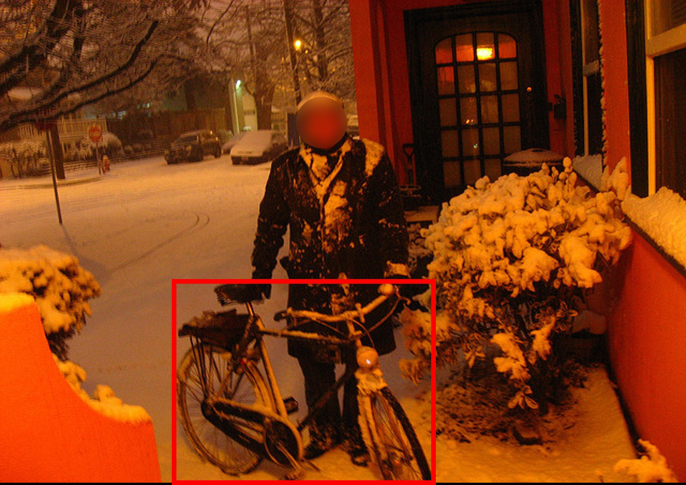

**图 2: Page 3 Img 12**

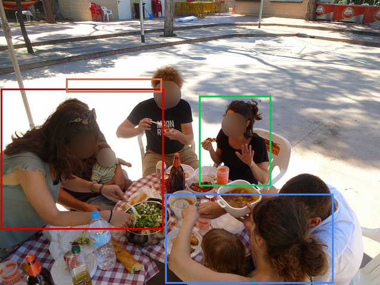

**图 3: Page 3 Img 5**

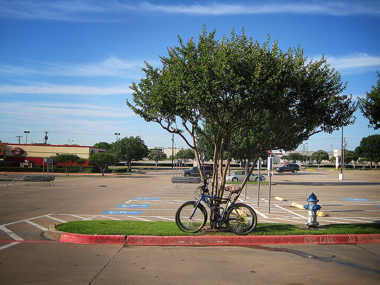

---

### 7. Bridging Network Fragmentation: A Semantic-Augmented DRL Framework for UAV-aided VANETs

**ArXiv ID**: 2603.18871v1
**作者**: Gaoxiang Cao, Wenke Yuan, Huasen He, Yunpeng Hou, Xiaofeng Jiang, Shuangwu Chen, Jian Yang

**链接**: [PDF](https://arxiv.org/pdf/2603.18871v1) | [Abstract](https://arxiv.org/abs/2603.18871v1)

#### 📄 原文摘要

Vehicular Ad-hoc Networks (VANETs) are the digital cornerstone of autonomous driving, yet they suffer from severe network fragmentation in urban environments due to physical obstructions. Unmanned Aerial Vehicles (UAVs), with their high mobility, have emerged as a vital solution to bridge these connectivity gaps. However, traditional Deep Reinforcement Learning (DRL)-based UAV deployment strategies lack semantic understanding of road topology, often resulting in blind exploration and sample inefficiency. By contrast, Large Language Models (LLMs) possess powerful reasoning capabilities capable of identifying topological importance, though applying them to control tasks remains challenging. To address this, we propose the Semantic-Augmented DRL (SA-DRL) framework. Firstly, we propose a fragmentation quantification method based on Road Topology Graphs (RTG) and Dual Connected Graphs (DCG). Subsequently, we design a four-stage pipeline to transform a general-purpose LLM into a domain-specific topology expert. Finally, we propose the Semantic-Augmented PPO (SA-PPO) algorithm, which employs a Logit Fusion mechanism to inject the LLM's semantic reasoning directly into the policy as a prior, effectively guiding the agent toward critical intersections. Extensive high-fidelity simulations demonstrate that SA-PPO achieves state-of-the-art performance with remarkable efficiency, reaching baseline performance levels using only 26.6% of the training episodes. Ultimately, SA-PPO improves two key connectivity metrics by 13.2% and 23.5% over competing methods, while reducing energy consumption to just 28.2% of the baseline.

#### 🌐 中文摘要

车载自组织网络 (VANET) 是自动驾驶的数字基石，但由于物理障碍，它们在城市环境中遭受严重的网络碎片化。无人机 (UAV) 凭借其高移动性，已成为弥合这些连接差距的重要解决方案。然而，传统的基于深度强化学习（DRL）的无人机部署策略缺乏对道路拓扑的语义理解，往往导致盲目探索和样本效率低下。相比之下，大型语言模型（LLM）拥有强大的推理能力，能够识别拓扑重要性，尽管将其应用于控制任务仍然具有挑战性。为了解决这个问题，我们提出了语义增强 DRL（SA-DRL）框架。首先，我们提出了一种基于道路拓扑图（RTG）和对偶连通图（DCG）的碎片量化方法。 随后，我们设计了一个四阶段管道，将通用 LLM 转变为特定领域的拓扑专家。最后，我们提出了语义增强 PPO (SA-PPO) 算法，该算法采用 Logit Fusion 机制将 LLM 的语义推理作为先验直接注入策略中，有效引导智能体走向关键交叉点。广泛的高保真模拟表明，SA-PPO 以卓越的效率实现了最先进的性能，仅使用 26.6% 的训练集就达到了基线性能水平。最终，与竞争方法相比，SA-PPO 将两个关键连接指标分别提高了 13.2% 和 23.5%，同时将能耗降低至基线的 28.2%。

#### 🏗️ 核心架构

以下为论文中体现核心架构的关键图表：

**图 1: Page 6 Img 6**

**图 2: Page 6 Img 2**

**图 3: Page 6 Img 1**

---

### 8. V-Dreamer: Automating Robotic Simulation and Trajectory Synthesis via Video Generation Priors

**ArXiv ID**: 2603.18811v1
**作者**: Songjia He, Zixuan Chen, Hongyu Ding, Dian Shao, Jieqi Shi, Chenxu Li, Jing Huo, Yang Gao

**链接**: [PDF](https://arxiv.org/pdf/2603.18811v1) | [Abstract](https://arxiv.org/abs/2603.18811v1)

#### 📄 原文摘要

Training generalist robots demands large-scale, diverse manipulation data, yet real-world collection is prohibitively expensive, and existing simulators are often constrained by fixed asset libraries and manual heuristics. To bridge this gap, we present V-Dreamer, a fully automated framework that generates open-vocabulary, simulation-ready manipulation environments and executable expert trajectories directly from natural language instructions. V-Dreamer employs a novel generative pipeline that constructs physically grounded 3D scenes using large language models and 3D generative models, validated by geometric constraints to ensure stable, collision-free layouts. Crucially, for behavior synthesis, we leverage video generation models as rich motion priors. These visual predictions are then mapped into executable robot trajectories via a robust Sim-to-Gen visual-kinematic alignment module utilizing CoTracker3 and VGGT. This pipeline supports high visual diversity and physical fidelity without manual intervention. To evaluate the generated data, we train imitation learning policies on synthesized trajectories encompassing diverse object and environment variations. Extensive evaluations on tabletop manipulation tasks using the Piper robotic arm demonstrate that our policies robustly generalize to unseen objects in simulation and achieve effective sim-to-real transfer, successfully manipulating novel real-world objects.

#### 🌐 中文摘要

训练多面手机器人需要大规模、多样化的操作数据，但现实世界的收集成本极其昂贵，而且现有的模拟器通常受到固定资产库和手动启发式的限制。为了弥补这一差距，我们推出了 V-Dreamer，这是一个完全自动化的框架，可以直接从自然语言指令生成开放词汇、模拟就绪的操作环境和可执行专家轨迹。 V-Dreamer 采用新颖的生成管道，使用大型语言模型和 3D 生成模型构建物理基础的 3D 场景，并通过几何约束进行验证，以确保稳定、无碰撞的布局。至关重要的是，对于行为合成，我们利用视频生成模型作为丰富的运动先验。然后，利用 CoTracker3 和 VGGT，通过强大的 Sim-to-Gen 视觉运动对准模块将这些视觉预测映射到可执行的机器人轨迹。 该管道支持高视觉多样性和物理保真度，无需人工干预。为了评估生成的数据，我们在包含不同对象和环境变化的合成轨迹上训练模仿学习策略。使用 Piper 机械臂对桌面操作任务进行的广泛评估表明，我们的策略可以稳健地推广到模拟中看不见的对象，并实现有效的模拟到真实的传输，成功地操纵新颖的现实世界对象。

#### 🏗️ 核心架构

以下为论文中体现核心架构的关键图表：

**图 1: Page 1 Img 13**

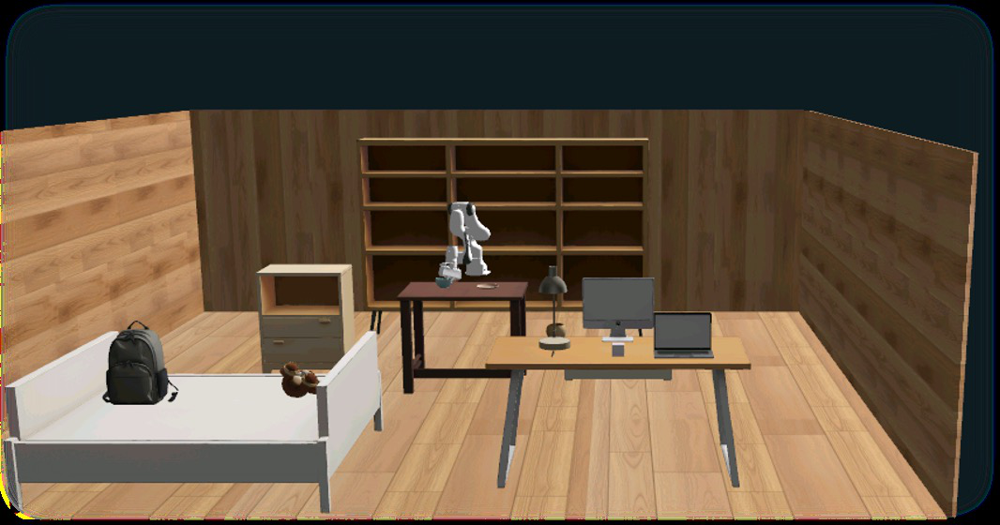

**图 2: Page 1 Img 1**

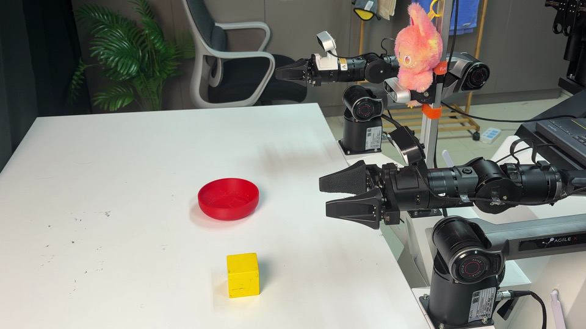

**图 3: Page 1 Img 12**

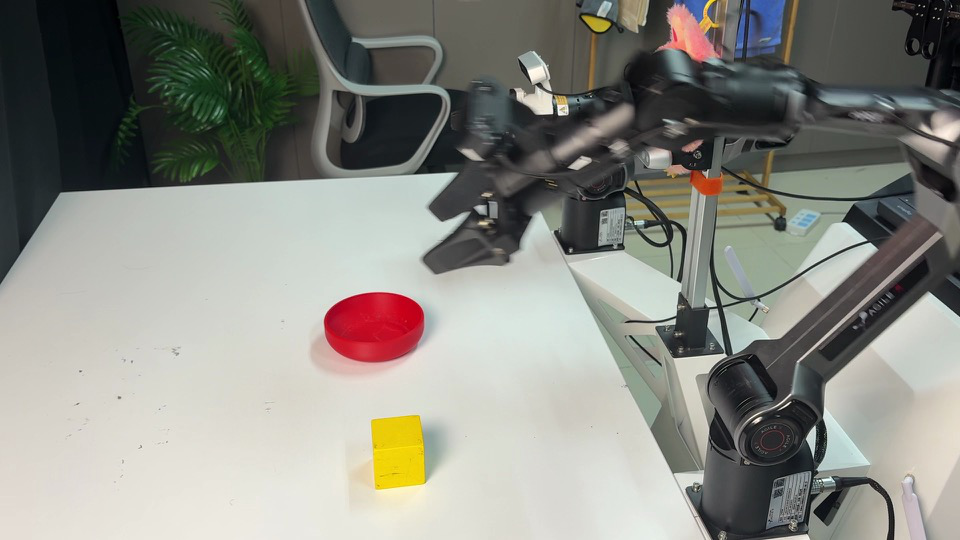

---

### 9. Perceptio: Perception Enhanced Vision Language Models via Spatial Token Generation

**ArXiv ID**: 2603.18795v1
**作者**: Yuchen Li, Amanmeet Garg, Shalini Chaudhuri, Rui Zhao, Garin Kessler

**链接**: [PDF](https://arxiv.org/pdf/2603.18795v1) | [Abstract](https://arxiv.org/abs/2603.18795v1)

#### 📄 原文摘要

Large Vision Language Models (LVLMs) excel at semantic understanding but struggle with fine grained spatial grounding, as the model must implicitly infer complex geometry without ever producing a spatial interpretation. We present Perceptio, a perception enhanced LVLM with 2D and 3D spatial reasoning abilities, enabled via explicit semantic segmentation tokens and depth tokens generated directly within the autoregressive sequence. Concretely, we (i) distill a VQVAE depth codebook from a strong monocular teacher to tokenize dense depth into compact sequences, and (ii) integrate SAM2 based semantic segmentation tokens and VQ-VAE depth tokens inside the LLM so the model first emits spatial tokens and then answers. To stabilize depth token generation, we introduce novel composite depth-token objectives (marker, token, and count losses) and a soft-merging technique for differentiable reconstruction. We adopt a multi-task co-training strategy across diverse datasets, letting the model learn perception tokens to tackle multiple downstream tasks. Building on InternVL, Perceptio achieves state-of-the-art performance across benchmarks: improving referring expression segmentation by +0.8/+1.4/+1.1 cIoU on RefCOCO/+/g HardBLINK spatial understanding accuracy by 10.3%, and MMBench accuracy by 1.0%, demonstrating that explicit spatial chain-of-thought materially strengthens spatial grounding in LVLMs.

#### 🌐 中文摘要

大视觉语言模型 (LVLM) 擅长语义理解，但难以处理细粒度的空间基础，因为该模型必须隐式推断复杂的几何形状，而不会产生空间解释。我们提出了 Perceptio，一种具有 2D 和 3D 空间推理能力的感知增强型 LVLM，通过在自回归序列中直接生成的显式语义分割标记和深度标记来实现。具体来说，我们 (i) 从强大的单目教师那里提取 VQVAE 深度密码本，将密集深度标记为紧凑序列，并且 (ii) 将基于 SAM2 的语义分割标记和 VQ-VAE 深度标记集成到 LLM 中，因此模型首先发出空间标记，然后给出答案。为了稳定深度标记的生成，我们引入了新颖的复合深度标记目标（标记、标记和计数损失）和用于可微重建的软合并技术。 我们在不同的数据集上采用多任务协同训练策略，让模型学习感知标记来处理多个下游任务基于 InternVL，Perceptio 在各个基准测试中实现了最先进的性能：在 RefCOCO/+/g HardBLINK 上将引用表达分割提高了 +0.8/+1.4/+1.1 cIoU，将空间理解准确度提高了 10.3%，将 MMBench 准确度提高了 1.0%，证明了显式空间理解思想链实质上加强了 LVLM 的空间基础。

---

### 10. Mi:dm K 2.5 Pro

**ArXiv ID**: 2603.18788v1
**作者**: KT Tech innovation Group

**链接**: [PDF](https://arxiv.org/pdf/2603.18788v1) | [Abstract](https://arxiv.org/abs/2603.18788v1)

#### 📄 原文摘要

The evolving LLM landscape requires capabilities beyond simple text generation, prioritizing multi-step reasoning, long-context understanding, and agentic workflows. This shift challenges existing models in enterprise environments, especially in Korean-language and domain-specific scenarios where scaling is insufficient. We introduce Mi:dm K 2.5 Pro, a 32B parameter flagship LLM designed to address enterprise-grade complexity through reasoning-focused optimization.   Our methodology builds a robust data foundation via a quality-centric curation pipeline utilizing abstract syntax tree (AST) analysis for code, gap-filling synthesis for mathematics, and an LLM-based quality evaluator. Pre-training scales the model via layer-predictor-based Depth Upscaling (DuS) and a progressive strategy supporting a 128K token context window. Post-training introduces a specialized multi-stage pipeline, including Reasoning SFT, model merging, and asynchronous reinforcement learning (RL), to develop complex problem-solving skills. "Fusion Training" then rebalances these capabilities with conversational fluency, consistent response styling, and reliable tool-use.   The evaluations show that Mi:dm K 2.5 Pro achieves competitive performance against leading global and domestic models. In addition, it sets state-of-the-art results on Korean-specific benchmarks, showcasing deep linguistic and cultural understanding. Finally, Responsible AI evaluations validate safety against attacks, ensuring a secure profile for deployment with a balance of harmlessness and responsiveness.

#### 🌐 中文摘要

不断发展的 LLM 格局需要的功能不仅仅是简单的文本生成、优先考虑多步骤推理、长上下文理解和代理工作流程。这种转变对企业环境中的现有模型提出了挑战，特别是在扩展不足的韩语和特定领域场景中。我们推出 Mi:dm K 2.5 Pro，这是一款 32B 参数旗舰级法学硕士，旨在通过以推理为重点的优化来解决企业级复杂性。   我们的方法通过以质量为中心的管理管道，利用代码抽象语法树 (AST) 分析、数学填补综合以及基于法学硕士的质量评估器，构建了强大的数据基础。预训练通过基于层预测器的深度放大 (DuS) 和支持 128K 令牌上下文窗口的渐进策略来缩放模型。 训练后引入专门的多阶段管道，包括推理 SFT、模型合并和异步强化学习 (RL)，以开发复杂的问题解决技能“融合训练”，然后通过流畅的对话、一致的响应样式和可靠的工具使用重新平衡这些能力。   评测结果显示，Mi:dm K 2.5 Pro的性能与国内外领先机型相比具有竞争力。此外，它还根据韩国特定的基准设定了最先进的结果，展示了深厚的语言和文化理解。最后，负责任的人工智能评估可验证针对攻击的安全性，确保部署的安全配置文件，并在无害性和响应性之间取得平衡。

#### 🏗️ 核心架构

以下为论文中体现核心架构的关键图表：

**图 1: Page 7 Img 4**

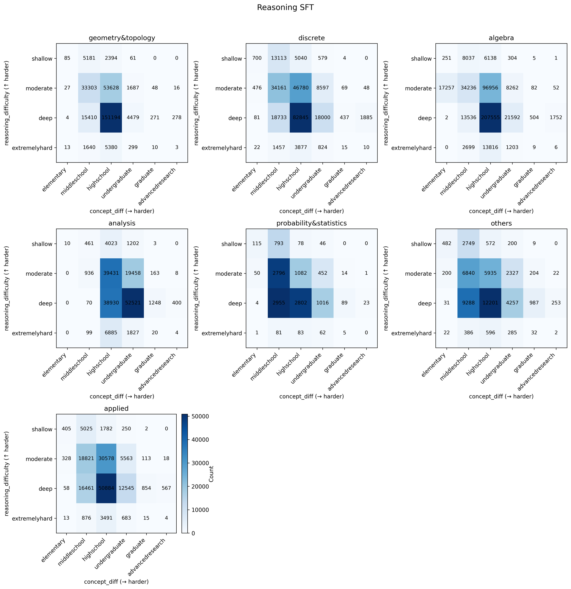

---

### 11. ViTac-Tracing: Visual-Tactile Imitation Learning of Deformable Object Tracing

**ArXiv ID**: 2603.18784v1
**作者**: Yongqiang Zhao, Haining Luo, Yupeng Wang, Emmanouil Spyrakos Papastavridis, Yiannis Demiris, Shan Luo

**链接**: [PDF](https://arxiv.org/pdf/2603.18784v1) | [Abstract](https://arxiv.org/abs/2603.18784v1)

#### 📄 原文摘要

Deformable objects often appear in unstructured configurations. Tracing deformable objects helps bringing them into extended states and facilitating the downstream manipulation tasks. Due to the requirements for object-specific modeling or sim-to-real transfer, existing tracing methods either lack generalizability across different categories of deformable objects or struggle to complete tasks reliably in the real world. To address this, we propose a novel visual-tactile imitation learning method to achieve one-dimensional (1D) and two-dimensional (2D) deformable object tracing with a unified model. Our method is designed from both local and global perspectives based on visual and tactile sensing. Locally, we introduce a weighted loss that emphasizes actions maintaining contact near the center of the tactile image, improving fine-grained adjustment. Globally, we propose a tracing task loss that helps the policy to regulate task progression. On the hardware side, to compensate for the limited features extracted from visual information, we integrate tactile sensing into a low-cost teleoperation system considering both the teleoperator and the robot. Extensive ablation and comparative experiments on diverse 1D and 2D deformable objects demonstrate the effectiveness of our approach, achieving an average success rate of 80% on seen objects and 65% on unseen objects.

#### 🌐 中文摘要

可变形对象通常出现在非结构化配置中，跟踪可变形对象有助于将它们带入扩展状态并促进下游操作任务。由于特定对象建模或模拟到真实转换的要求，现有的跟踪方法要么缺乏跨不同类别可变形对象的通用性，要么难以在现实世界中可靠地完成任务。为了解决这个问题，我们提出了一种新颖的视觉触觉模仿学习方法，以通过统一的模型实现一维（1D）和二维（2D）可变形对象跟踪。我们的方法是基于视觉和触觉感知从局部和全局角度设计的。在局部，我们引入了一种加权损失，强调在触觉图像中心附近保持接触的动作，从而改善细粒度的调整。在全球范围内，我们提出了跟踪任务丢失的方案，以帮助政策调节任务进展。 在硬件方面，为了弥补从视觉信息中提取的有限特征，我们将触觉传感集成到考虑远程操作员和机器人的低成本远程操作系统中。对各种一维和二维可变形物体的广泛消融和比较实验证明了我们方法的有效性，在看到的物体上实现了 80% 的平均成功率，在看不见的物体上实现了 65% 的平均成功率。

#### 🏗️ 核心架构

以下为论文中体现核心架构的关键图表：

**图 1: Page 3 Img 4**

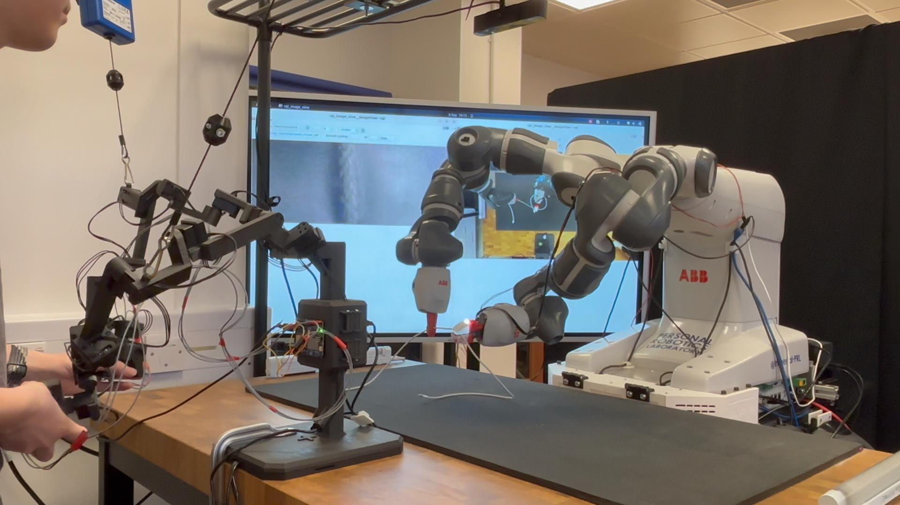

**图 2: Page 1 Img 3**

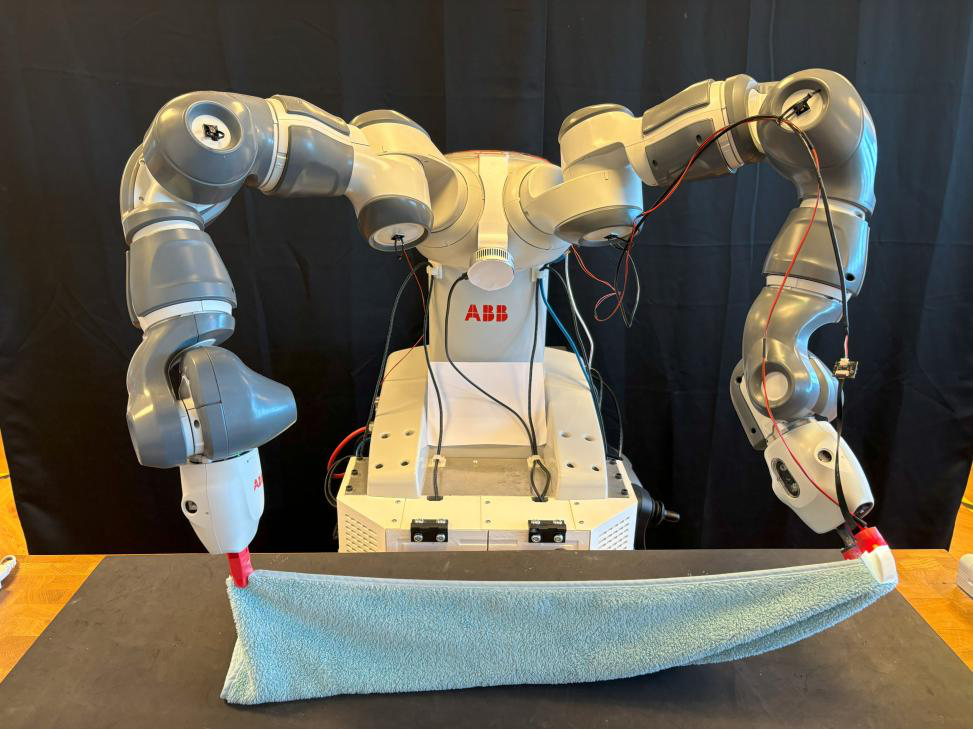

**图 3: Page 1 Img 4**

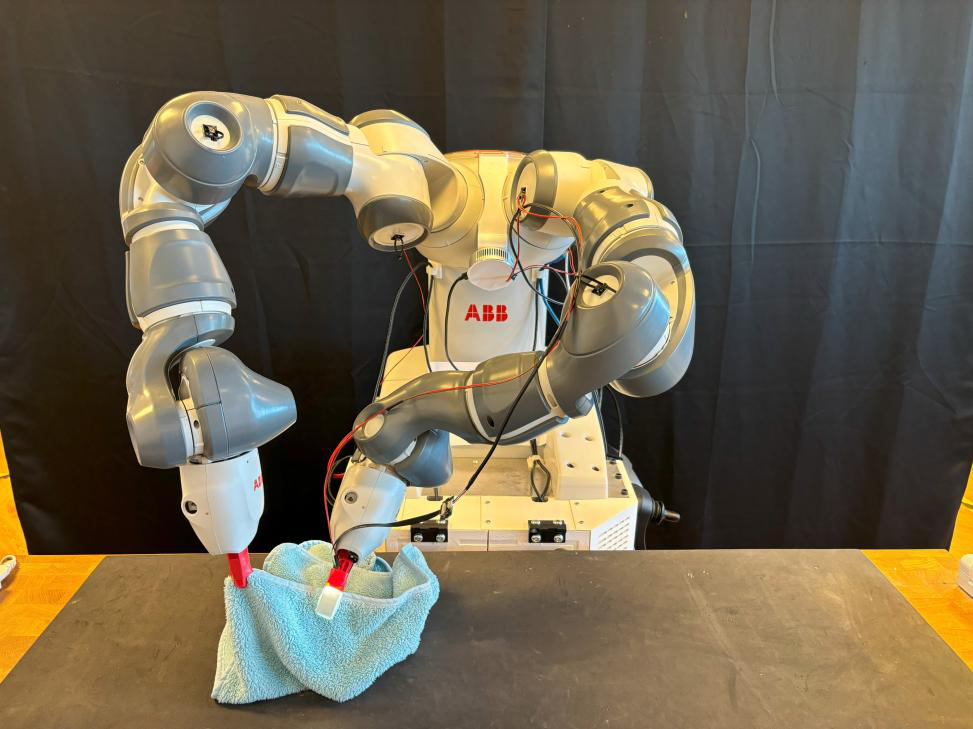

---

### 12. Automatic Configuration of LLM Post-Training Pipelines

**ArXiv ID**: 2603.18773v1
**作者**: Channe Chwa, Xinle Wu, Yao Lu

**链接**: [PDF](https://arxiv.org/pdf/2603.18773v1) | [Abstract](https://arxiv.org/abs/2603.18773v1)

#### 📄 原文摘要

LLM post-training pipelines that combine supervised fine-tuning and reinforcement learning are difficult to configure under realistic compute budgets: the configuration space is high-dimensional and heterogeneous, stages are strongly coupled, and each end-to-end evaluation is expensive. We propose AutoPipe, a budget-aware two-stage framework for configuration selection in LLM post-training. Offline, AutoPipe learns a dataset-conditioned learning-to-rank surrogate from historical runs, capturing within-dataset preferences and providing transferable guidance toward promising regions of the configuration space. Online, for a new dataset, AutoPipe uses the offline guidance to steer Bayesian optimization and models dataset-specific deviations with a Gaussian-process residual surrogate. To reduce evaluation cost, each trial is early-stopped and scored by a learned predictor that maps early training signals to a low-cost proxy for final post-training performance. Experiments on biomedical reasoning tasks show that AutoPipe consistently outperforms offline-only baselines and achieves comparable performance with the strongest online HPO baselines while using less than 10\% of their computational cost.

#### 🌐 中文摘要

结合监督微调和强化学习的LLM后训练管道很难在现实的计算预算下配置：配置空间是高维和异构的，阶段强耦合，每个端到端评估都很昂贵。我们提出了AutoPipe，一个预算感知的两阶段框架，用于LLM后训练中的配置选择。离线时，AutoPipe 从历史运行中学习数据集条件下的学习排名代理，捕获数据集内的偏好，并为配置空间的有希望的区域提供可转移的指导。对于在线新数据集，AutoPipe 使用离线指导来引导贝叶斯优化，并使用高斯过程残差代理对数据集特定的偏差进行建模。为了降低评估成本，每次试验都会提前停止并由学习预测器进行评分，该预测器将早期训练信号映射到最终训练后性能的低成本代理。 生物医学推理任务的实验表明，AutoPipe 始终优于仅离线基线，并实现了与最强的在线 HPO 基线相当的性能，同时使用的计算成本不到 10%。

---

### 13. Empathetic Motion Generation for Humanoid Educational Robots via Reasoning-Guided Vision--Language--Motion Diffusion Architecture

**ArXiv ID**: 2603.18771v1
**作者**: Fuze Sun, Lingyu Li, Lekan Dai, Xinyu Fan

**链接**: [PDF](https://arxiv.org/pdf/2603.18771v1) | [Abstract](https://arxiv.org/abs/2603.18771v1)

#### 📄 原文摘要

This article suggests a reasoning-guided vision-language-motion diffusion framework (RG-VLMD) for generating instruction-aware co-speech gestures for humanoid robots in educational scenarios. The system integrates multi-modal affective estimation, pedagogical reasoning, and teaching-act-conditioned motion synthesis to enable adaptive and semantically consistent robot behavior. A gated mixture-of-experts model predicts Valence/Arousal from input text, visual, and acoustic features, which then mapped to discrete teaching-act categories through an affect-driven policy.These signals condition a diffusion-based motion generator using clip-level intent and frame-level instructional schedules via additive latent restriction with auxiliary action-group supervision. Compared to a baseline diffusion model, our proposed method produces more structured and distinctive motion patterns, as verified by motion statics and pairwise distance analysis. Generated motion sequences remain physically plausible and can be retargeted to a NAO robot for real-time execution. The results reveal that reasoning-guided instructional conditioning improves gesture controllability and pedagogical expressiveness in educational human-robot interaction.

#### 🌐 中文摘要

本文提出了一种推理引导的视觉语言运动扩散框架（RG-VLMD），用于在教育场景中为人形机器人生成指令感知的协同语音手势。该系统集成了多模态情感估计、教学推理和教学行为条件运动合成，以实现自适应且语义一致的机器人行为。门控专家混合模型根据输入文本、视觉和声学特征预测效价/唤醒，然后通过情感驱动策略映射到离散的教学行为类别。这些信号通过带有辅助动作组监督的附加潜在限制，使用剪辑级意图和帧级教学计划来调节基于扩散的运动生成器。与基线扩散模型相比，我们提出的方法产生了更加结构化和独特的运动模式，正如运动静力学和成对距离分析所验证的那样。 生成的运动序列在物理上仍然合理，并且可以重新定位到 NAO 机器人进行实时执行。结果表明，推理引导的教学调节提高了教育人机交互中的手势可控性和教学表现力。

#### 🏗️ 核心架构

以下为论文中体现核心架构的关键图表：

**图 1: Page 6 Img 1**

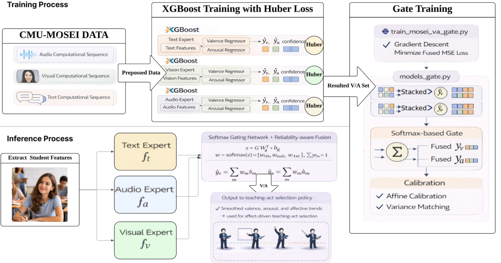

**图 2: Page 9 Img 1**

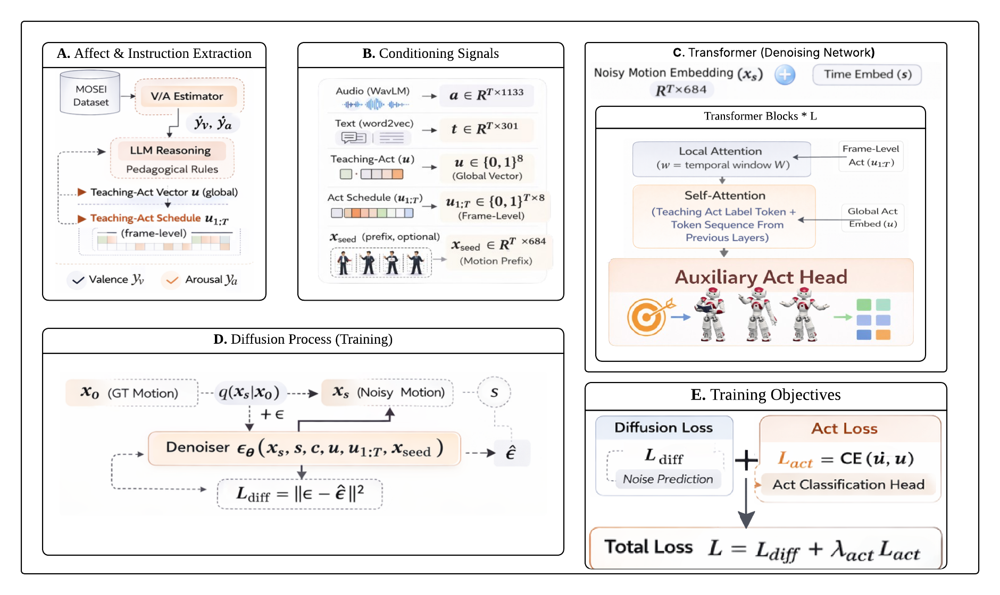

---

### 14. Memento-Skills: Let Agents Design Agents

**ArXiv ID**: 2603.18743v1
**作者**: Huichi Zhou, Siyuan Guo, Anjie Liu, Zhongwei Yu, Ziqin Gong, Bowen Zhao, Zhixun Chen, Menglong Zhang, Yihang Chen, Jinsong Li, Runyu Yang, Qiangbin Liu, Xinlei Yu, Jianmin Zhou, Na Wang, Chunyang Sun, Jun Wang

**链接**: [PDF](https://arxiv.org/pdf/2603.18743v1) | [Abstract](https://arxiv.org/abs/2603.18743v1)

#### 📄 原文摘要

We introduce \emph{Memento-Skills}, a generalist, continually-learnable LLM agent system that functions as an \emph{agent-designing agent}: it autonomously constructs, adapts, and improves task-specific agents through experience. The system is built on a memory-based reinforcement learning framework with \emph{stateful prompts}, where reusable skills (stored as structured markdown files) serve as persistent, evolving memory. These skills encode both behaviour and context, enabling the agent to carry forward knowledge across interactions.   Starting from simple elementary skills (like Web search and terminal operations), the agent continually improves via the \emph{Read--Write Reflective Learning} mechanism introduced in \emph{Memento~2}~\cite{wang2025memento2}. In the \emph{read} phase, a behaviour-trainable skill router selects the most relevant skill conditioned on the current stateful prompt; in the \emph{write} phase, the agent updates and expands its skill library based on new experience. This closed-loop design enables \emph{continual learning without updating LLM parameters}, as all adaptation is realised through the evolution of externalised skills and prompts.   Unlike prior approaches that rely on human-designed agents, Memento-Skills enables a generalist agent to \emph{design agents end-to-end} for new tasks. Through iterative skill generation and refinement, the system progressively improves its own capabilities. Experiments on the \emph{General AI Assistants} benchmark and \emph{Humanity's Last Exam} demonstrate sustained gains, achieving 26.2\% and 116.2\% relative improvements in overall accuracy, respectively. Code is available at https://github.com/Memento-Teams/Memento-Skills.

#### 🌐 中文摘要

我们介绍 \emph{Memento-Skills}，一个通才的、可持续学习的 LLM 代理系统，其功能相当于 \emph{代理设计代理}：它通过经验自主构建、适应和改进特定任务的代理。该系统建立在基于记忆的强化学习框架上，具有 \emph{状态提示}，其中可重用技能（存储为结构化 Markdown 文件）充当持久的、不断发展的记忆。这些技能对行为和上下文进行编码，使代理能够在交互中传播知识。   从简单的基本技能（如网络搜索和终端操作）开始，代理通过 \emph{Memento~2}~\cite{wang2025memento2} 中引入的 \emph{Read--Write Reflective Learning} 机制不断改进。 在 \emph{read} 阶段，行为可训练技能路由器根据当前状态提示选择最相关的技能；在\emph{写入}阶段，代理根据新的经验更新和扩展其技能库。这种闭环设计使得\emph{无需更新LLM参数即可持续学习}，因为所有适应都是通过外化技能和提示的演变来实现的。   与之前依赖人工设计代理的方法不同，Memento-Skills 使多面手代理能够为新任务\emph{端到端设计代理}。通过迭代技能生成和细化，系统逐步提高自身能力。 \emph{General AI Assistants} 基准测试和 \emph{Humanity's Last Exam} 的实验展示了持续的收益，总体准确率分别实现了 26.2% 和 116.2% 的相对改进。代码可在 https://github.com/Memento-Teams/Memento-Skills 获取。

#### 🏗️ 核心架构

以下为论文中体现核心架构的关键图表：

**图 1: Page 8 Img 1**

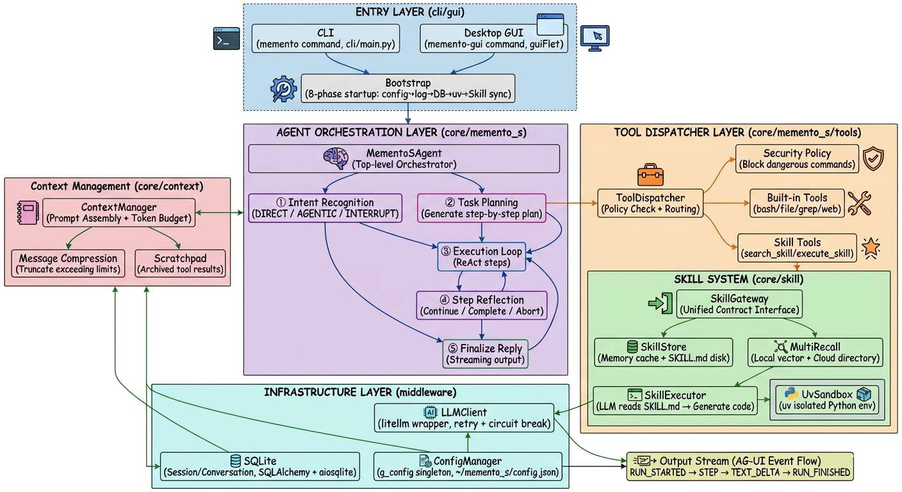

**图 2: Page 5 Img 1**

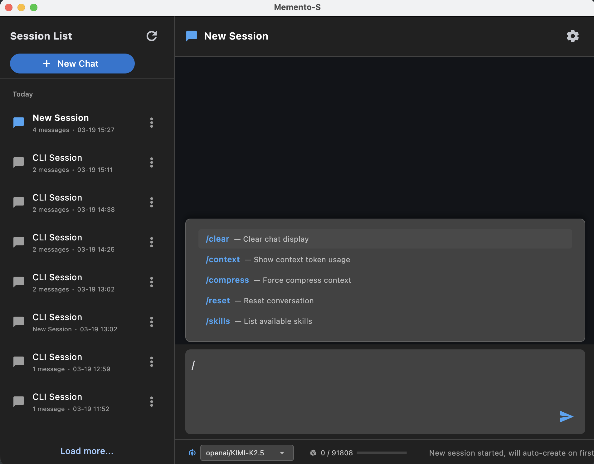

**图 3: Page 6 Img 12**

---

### 15. Accurate and Efficient Multi-Channel Time Series Forecasting via Sparse Attention Mechanism

**ArXiv ID**: 2603.18712v1
**作者**: Lei Gao, Hengda Bao, Jingfei Fang, Guangzheng Wu, Weihua Zhou, Yun Zhou

**链接**: [PDF](https://arxiv.org/pdf/2603.18712v1) | [Abstract](https://arxiv.org/abs/2603.18712v1)

#### 📄 原文摘要

The task of multi-channel time series forecasting is ubiquitous in numerous fields such as finance, supply chain management, and energy planning. It is critical to effectively capture complex dynamic dependencies within and between channels for accurate predictions. However, traditional method paid few attentions on learning the interaction among channels. This paper proposes Linear-Network (Li-Net), a novel architecture designed for multi-channel time series forecasting that captures the linear and non-linear dependencies among channels. Li-Net dynamically compresses representations across sequence and channel dimensions, processes the information through a configurable non-linear module and subsequently reconstructs the forecasts. Moreover, Li-Net integrates a sparse Top-K Softmax attention mechanism within a multi-scale projection framework to address these challenges. A core innovation is its ability to seamlessly incorporate and fuse multi-modal embeddings, guiding the sparse attention process to focus on the most informative time steps and feature channels. Through the experiment results on multiple real-world benchmark datasets demonstrate that Li-Net achieves competitive performance compared to state-of-the-art baseline methods. Furthermore, Li-Net provides a superior balance between prediction accuracy and computational burden, exhibiting significantly lower memory usage and faster inference times. Detailed ablation studies and parameter sensitivity analyses validate the effectiveness of each key component in our proposed architecture.   Keywords: Multivariate Time Series Forecasting, Sparse Attention Mechanism, Multimodal Information Fusion, Non-linear relationship

#### 🌐 中文摘要

多渠道时间序列预测的任务在金融、供应链管理和能源规划等众多领域中普遍存在，有效捕获渠道内部和渠道之间复杂的动态依赖关系以进行准确预测至关重要。然而，传统方法很少关注学习通道之间的交互。本文提出了线性网络（Li-Net），这是一种专为多通道时间序列预测而设计的新颖架构，可捕获通道之间的线性和非线性依赖性。 Li-Net 动态压缩序列和通道维度的表示，通过可配置的非线性模块处理信息，然后重建预测。此外，Li-Net 在多尺度投影框架中集成了稀疏 Top-K Softmax 注意力机制来应对这些挑战。 一个核心创新在于其无缝整合和融合多模态嵌入的能力，引导稀疏注意力过程专注于信息最丰富的时间步长和特征通道。通过在多个真实世界基准数据集上的实验结果表明，与最先进的基线方法相比，Li-Net 实现了具有竞争力的性能。此外，Li-Net 在预测精度和计算负担之间提供了卓越的平衡，显着降低了内存使用量并加快了推理时间。详细的消融研究和参数敏感性分析验证了我们提出的架构中每个关键组件的有效性。   关键词：多元时间序列预测、稀疏注意力机制、多模态信息融合、非线性关系。

#### 🏗️ 核心架构

以下为论文中体现核心架构的关键图表：

**图 1: Page 5 Img 1**

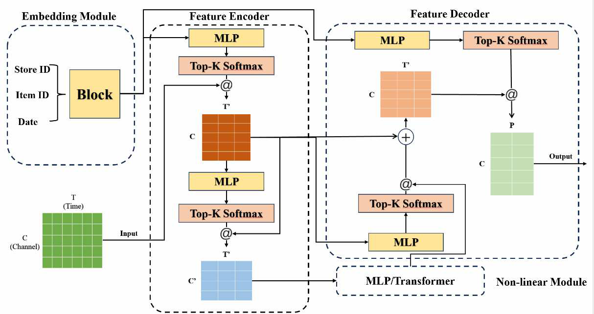

---

### 16. HISR: Hindsight Information Modulated Segmental Process Rewards For Multi-turn Agentic Reinforcement Learning

**ArXiv ID**: 2603.18683v1
**作者**: Zhicong Lu, Zichuan Lin, Wei Jia, Changyuan Tian, Deheng Ye, Peiguang Li, Li Jin, Nayu Liu, Guangluan Xu, Wei Feng

**链接**: [PDF](https://arxiv.org/pdf/2603.18683v1) | [Abstract](https://arxiv.org/abs/2603.18683v1)

#### 📄 原文摘要

While large language models excel in diverse domains, their performance on complex longhorizon agentic decision-making tasks remains limited. Most existing methods concentrate on designing effective reward models (RMs) to advance performance via multi-turn reinforcement learning. However, they suffer from delayed propagation in sparse outcome rewards and unreliable credit assignment with potentially overly fine-grained and unfocused turnlevel process rewards. In this paper, we propose (HISR) exploiting Hindsight Information to modulate Segmental process Rewards, which closely aligns rewards with sub-goals and underscores significant segments to enhance the reliability of credit assignment. Specifically, a segment-level process RM is presented to assign rewards for each sub-goal in the task, avoiding excessively granular allocation to turns. To emphasize significant segments in the trajectory, a hindsight model is devised to reflect the preference of performing a certain action after knowing the trajectory outcome. With this characteristic, we design the ratios of sequence likelihoods between hindsight and policy model to measure action importance. The ratios are subsequently employed to aggregate segment importance scores, which in turn modulate segmental process rewards, enhancing credit assignment reliability. Extensive experimental results on three publicly benchmarks demonstrate the validity of our method.

#### 🌐 中文摘要

虽然大型语言模型在不同领域表现出色，但它们在复杂的长期代理决策任务上的性能仍然有限。大多数现有方法集中于设计有效的奖励模型（RM），以通过多轮强化学习来提高性能。然而，它们受到稀疏结果奖励的延迟传播和不可靠的信用分配以及可能过于细粒度和不集中的周转过程奖励的困扰。在本文中，我们建议（HISR）利用事后信息来调整分段流程奖励，它将奖励与子目标紧密结合，并强调重要的分段，以提高学分分配的可靠性。具体来说，提出了分段级流程 RM 来为任务中的每个子目标分配奖励，避免过于细粒度的轮次分配。 为了强调轨迹中的重要部分，设计了事后模型来反映在知道轨迹结果后执行特定操作的偏好。利用这一特性，我们设计了事后模型和策略模型之间的序列似然比来衡量操作的重要性。随后使用这些比率来汇总细分重要性分数，从而调节细分流程奖励，从而提高信用分配的可靠性。三个公开基准的广泛实验结果证明了我们方法的有效性。

---

### 17. Thinking with Constructions: A Benchmark and Policy Optimization for Visual-Text Interleaved Geometric Reasoning

**ArXiv ID**: 2603.18662v1
**作者**: Haokun Zhao, Wanshi Xu, Haidong Yuan, Songjun Cao, Long Ma, Yanghua Xiao

**链接**: [PDF](https://arxiv.org/pdf/2603.18662v1) | [Abstract](https://arxiv.org/abs/2603.18662v1)

#### 📄 原文摘要

Geometric reasoning inherently requires "thinking with constructions" -- the dynamic manipulation of visual aids to bridge the gap between problem conditions and solutions. However, existing Multimodal Large Language Models (MLLMs) are largely confined to passive inference with static diagrams, lacking the strategic knowledge of when and how to construct effective visual aids. To address this, we present a framework for Visual-Text Interleaved Chain-of-Thought. We first introduce GeoAux-Bench, the first benchmark comprising 4,334 geometry problems that aligns textual construction steps with ground-truth visual updates. Our pilot study reveals two critical insights: (1) interleaved visual-textual aids outperform single-modality counterparts, which cannot losslessly capture geometric synergy; and (2) valid constructions act as entropy reducers, strongly correlating with reduced reasoning perplexity. Building on these findings, we propose Action Applicability Policy Optimization (A2PO), a reinforcement learning paradigm for mastering strategic construction. A2PO employs Adaptive Reward Shaping to regulate the timing and quality of visual aids via counterfactual sampling to distinguish necessary from redundant constructions. Experiments demonstrate our approach enables MLLMs to leverage selective auxiliary constructions, yielding a 3.51% gain over strong baselines. Code and data are available on GitHub.

#### 🌐 中文摘要

几何推理本质上需要“用结构思考”——动态操纵视觉辅助工具来弥合问题条件和解决方案之间的差距。然而，现有的多模态大型语言模型（MLLM）很大程度上局限于静态图的被动推理，缺乏何时以及如何构建有效视觉辅助工具的战略知识。为了解决这个问题，我们提出了一个视觉文本交错思维链框架。我们首先介绍 GeoAux-Bench，这是第一个基准测试，包含 4,334 个几何问题，将文本构建步骤与真实视觉更新相结合。我们的试点研究揭示了两个重要的见解：（1）交错的视觉文本辅助优于单一模态的辅助工具，后者无法无损地捕获几何协同作用； (2) 有效的结构充当熵减少器，与减少推理困惑密切相关。 基于这些发现，我们提出了行动适用性策略优化（A2PO），这是一种用于掌握战略构建的强化学习范式。A2PO 采用自适应奖励塑造，通过反事实采样来调节视觉辅助的时间和质量，以区分必要的结构和冗余的结构。实验表明，我们的方法使 MLLM 能够利用选择性辅助结构，比强基线获得 3.51% 的增益。代码和数据可在 GitHub 上获取。

#### 🏗️ 核心架构

以下为论文中体现核心架构的关键图表：

**图 1: Page 4 Img 2**

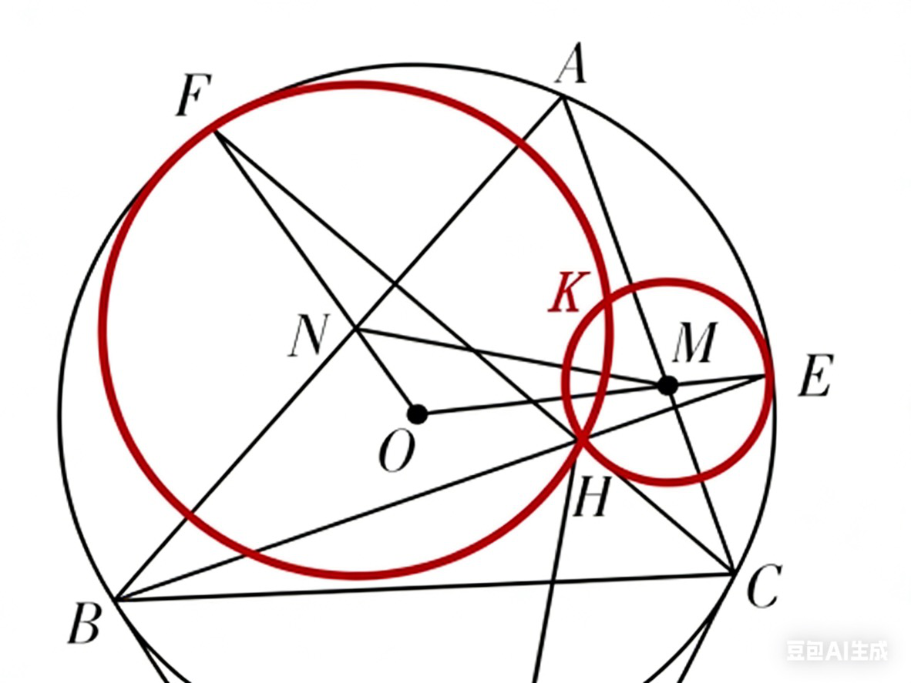

**图 2: Page 4 Img 1**

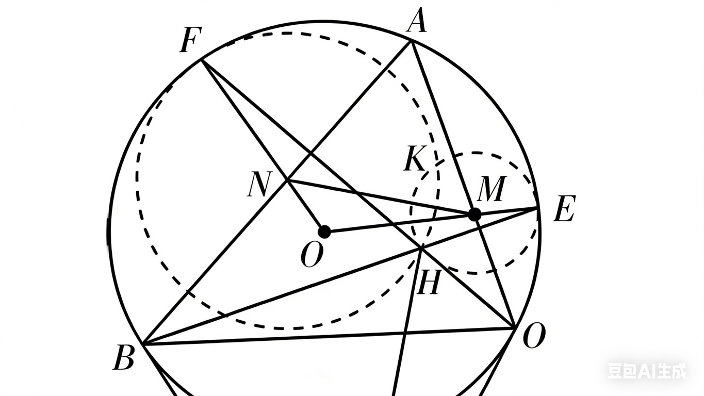

**图 3: Page 1 Img 2**

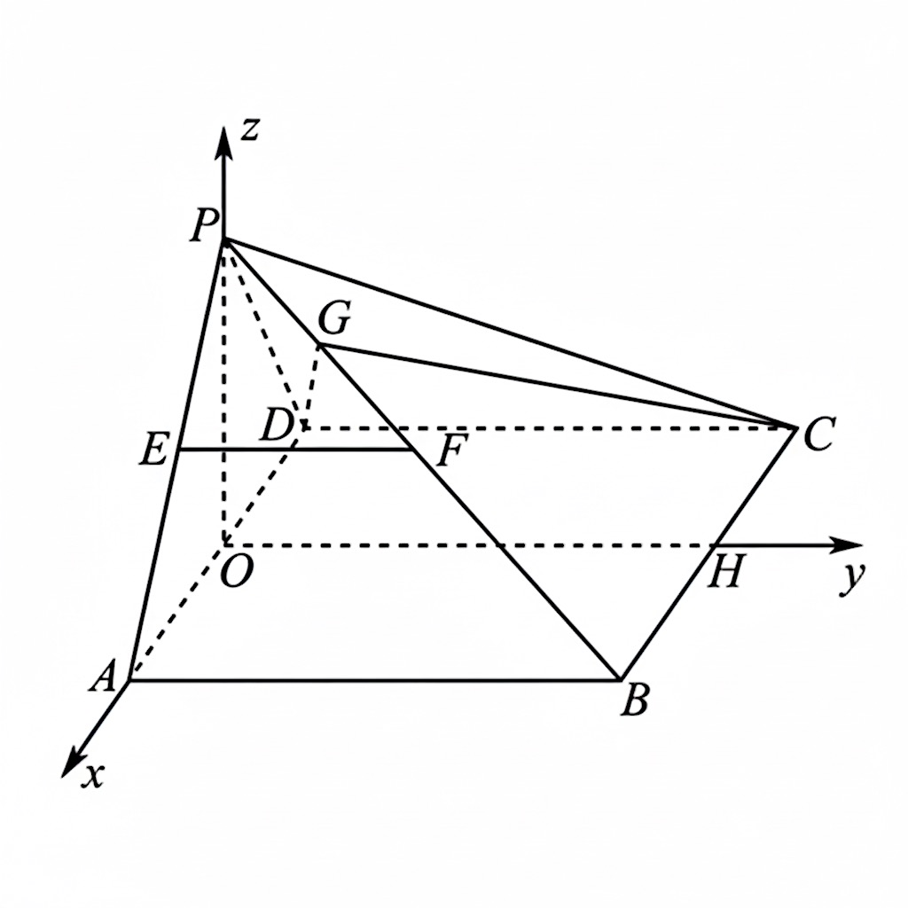

---

### 18. Balanced Thinking: Improving Chain of Thought Training in Vision Language Models

**ArXiv ID**: 2603.18656v1
**作者**: Shaked Perek, Ben Wiesel, Avihu Dekel, Nimrod Shabtay, Eli Schwartz

**链接**: [PDF](https://arxiv.org/pdf/2603.18656v1) | [Abstract](https://arxiv.org/abs/2603.18656v1)

#### 📄 原文摘要

Multimodal reasoning in vision-language models (VLMs) typically relies on a two-stage process: supervised fine-tuning (SFT) and reinforcement learning (RL). In standard SFT, all tokens contribute equally to the loss, even though reasoning data are inherently token-imbalanced. Long <think> traces overshadow short but task-critical <answer> segments, leading to verbose reasoning and inaccurate answers. We propose SCALe (Scheduled Curriculum Adaptive Loss), which explicitly separates supervision over reasoning and answer segments using dynamic, length-independent weighting. Unlike vanilla SFT, which overweights the <think> segment, SCALe-SFT gradually shifts the focus from <think> to <answer> throughout training via a cosine scheduling policy, encouraging concise and well-grounded reasoning. We evaluate SCALe across diverse benchmarks and architectures. Results show that SCALe consistently improves accuracy over vanilla SFT and matches the performance of the full two-phase SFT + GRPO pipeline while requiring only about one-seventh of the training time, making it a lightweight yet effective alternative. When combined with GRPO, SCALe achieves the best overall performance, highlighting its value both as a standalone method and as a strong foundation for reinforcement refinement.

#### 🌐 中文摘要

视觉语言模型 (VLM) 中的多模态推理通常依赖于两阶段过程：监督微调 (SFT) 和强化学习 (RL)。在标准 SFT 中，所有标记对损失的贡献均等，即使推理数据本质上是标记不平衡的。长的<think>跟踪掩盖了短但任务关键的<answer>段，导致冗长的推理和不准确的答案。我们提出了 SCALe（预定课程自适应损失），它使用动态的、与长度无关的权重明确地将推理和答案部分的监督分开。与超重 <think> 部分的普通 SFT 不同，SCALe-SFT 通过余弦调度策略在整个训练过程中逐渐将焦点从 <think> 转移到 <answer>，鼓励简洁且有根据的推理。我们通过不同的基准和架构来评估 SCALe。 结果表明，SCALe 持续提高了普通 SFT 的准确性，并与完整的两阶段 SFT + GRPO 管道的性能相匹配，同时只需要大约七分之一的训练时间，使其成为一种轻量级但有效的替代方案。当与 GRPO 结合时，SCALe 实现了最佳的整体性能，突出了其作为独立方法和作为强化细化的坚实基础的价值。

#### 🏗️ 核心架构

以下为论文中体现核心架构的关键图表：

**图 1: Page 8 Img 1**

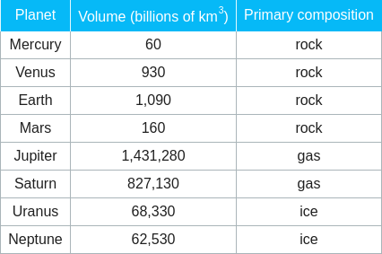

**图 2: Page 6 Img 1**

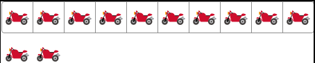

---

### 19. Agentic Flow Steering and Parallel Rollout Search for Spatially Grounded Text-to-Image Generation

**ArXiv ID**: 2603.18627v1
**作者**: Ping Chen, Daoxuan Zhang, Xiangming Wang, Yungeng Liu, Haijin Zeng, Yongyong Chen

**链接**: [PDF](https://arxiv.org/pdf/2603.18627v1) | [Abstract](https://arxiv.org/abs/2603.18627v1)

#### 📄 原文摘要

Precise Text-to-Image (T2I) generation has achieved great success but is hindered by the limited relational reasoning of static text encoders and the error accumulation in open-loop sampling. Without real-time feedback, initial semantic ambiguities during the Ordinary Differential Equation trajectory inevitably escalate into stochastic deviations from spatial constraints. To bridge this gap, we introduce AFS-Search (Agentic Flow Steering and Parallel Rollout Search), a training-free closed-loop framework built upon FLUX.1-dev. AFS-Search incorporates a training-free closed-loop parallel rollout search and flow steering mechanism, which leverages a Vision-Language Model (VLM) as a semantic critic to diagnose intermediate latents and dynamically steer the velocity field via precise spatial grounding. Complementarily, we formulate T2I generation as a sequential decision-making process, exploring multiple trajectories through lookahead simulations and selecting the optimal path based on VLM-guided rewards. Further, we provide AFS-Search-Pro for higher performance and AFS-Search-Fast for quicker generation. Experimental results show that our AFS-Search-Pro greatly boosts the performance of the original FLUX.1-dev, achieving state-of-the-art results across three different benchmarks. Meanwhile, AFS-Search-Fast also significantly enhances performance while maintaining fast generation speed.

#### 🌐 中文摘要

精确的文本到图像（T2I）生成取得了巨大的成功，但受到静态文本编码器有限的关系推理和开环采样中的误差累积的阻碍。在没有实时反馈的情况下，常微分方程轨迹期间的初始语义模糊性不可避免地升级为空间约束的随机偏差。为了弥补这一差距，我们引入了 AFS-Search（代理流程转向和并行推出搜索），这是一个基于 FLUX.1-dev 构建的免训练闭环框架。 AFS-Search 结合了免训练闭环并行推出搜索和流转向机制，利用视觉语言模型 (VLM) 作为语义批评家来诊断中间潜伏并通过精确的空间基础动态引导速度场。 作为补充，我们将 T2I 生成制定为顺序决策过程，通过前瞻模拟探索多个轨迹，并根据 VLM 引导的奖励选择最佳路径。此外，我们提供 AFS-Search-Pro 以获得更高的性能，并提供 AFS-Search-Fast 以获得更快的生成。实验结果表明，我们的 AFS-Search-Pro 极大地提高了原始 FLUX.1-dev 的性能，在三个不同的基准测试中取得了最先进的结果。同时，AFS-Search-Fast在保持快速生成速度的同时也显着增强了性能。

#### 🏗️ 核心架构

以下为论文中体现核心架构的关键图表：

**图 1: Page 5 Img 4**

**图 2: Page 1 Img 1**

**图 3: Page 5 Img 11**

---

### 20. Learning to Self-Evolve

**ArXiv ID**: 2603.18620v1
**作者**: Xiaoyin Chen, Canwen Xu, Yite Wang, Boyi Liu, Zhewei Yao, Yuxiong He

**链接**: [PDF](https://arxiv.org/pdf/2603.18620v1) | [Abstract](https://arxiv.org/abs/2603.18620v1)

#### 📄 原文摘要

We introduce Learning to Self-Evolve (LSE), a reinforcement learning framework that trains large language models (LLMs) to improve their own contexts at test time. We situate LSE in the setting of test-time self-evolution, where a model iteratively refines its context from feedback on seen problems to perform better on new ones. Existing approaches rely entirely on the inherent reasoning ability of the model and never explicitly train it for this task. LSE reduces the multi-step evolution problem to a single-step RL objective, where each context edit is rewarded by the improvement in downstream performance. We pair this objective with a tree-guided evolution loop. On Text-to-SQL generation (BIRD) and general question answering (MMLU-Redux), a 4B-parameter model trained with LSE outperforms self-evolving policies powered by GPT-5 and Claude Sonnet 4.5, as well as prompt optimization methods including GEPA and TextGrad, and transfers to guide other models without additional training. Our results highlight the effectiveness of treating self-evolution as a learnable skill.

#### 🌐 中文摘要

我们引入了自我进化学习（LSE），这是一种强化学习框架，可训练大型语言模型（LLM）以在测试时改善其自身的上下文。我们将 LSE 置于测试时自我进化的环境中，其中模型根据所见问题的反馈迭代地完善其上下文，以便在新问题上表现更好。现有的方法完全依赖于模型固有的推理能力，并且从未针对此任务明确地训练它。 LSE 将多步进化问题简化为单步 RL 目标，其中每次上下文编辑都会因下游性能的提高而得到奖励。我们将这个目标与树引导的进化循环配对。在文本到 SQL 生成 (BIRD) 和一般问题解答 (MMLU-Redux) 方面，使用 LSE 训练的 4B 参数模型优于由 GPT-5 和 Claude Sonnet 4.5 提供支持的自我进化策略，以及包括 GEPA 和 TextGrad 在内的即时优化方法，并且无需额外训练即可转移到指导其他模型。 我们的结果强调了将自我进化视为可学习技能的有效性。

#### 🏗️ 核心架构

以下为论文中体现核心架构的关键图表：

**图 1: Page 2 Img 2**

**图 2: Page 2 Img 9**

**图 3: Page 2 Img 8**

---

### 21. MedForge: Interpretable Medical Deepfake Detection via Forgery-aware Reasoning

**ArXiv ID**: 2603.18577v1
**作者**: Zhihui Chen, Kai He, Qingyuan Lei, Bin Pu, Jian Zhang, Yuling Xu, Mengling Feng

**链接**: [PDF](https://arxiv.org/pdf/2603.18577v1) | [Abstract](https://arxiv.org/abs/2603.18577v1)

#### 📄 原文摘要

Text-guided image editors can now manipulate authentic medical scans with high fidelity, enabling lesion implantation/removal that threatens clinical trust and safety. Existing defenses are inadequate for healthcare. Medical detectors are largely black-box, while MLLM-based explainers are typically post-hoc, lack medical expertise, and may hallucinate evidence on ambiguous cases. We present MedForge, a data-and-method solution for pre-hoc, evidence-grounded medical forgery detection. We introduce MedForge-90K, a large-scale benchmark of realistic lesion edits across 19 pathologies with expert-guided reasoning supervision via doctor inspection guidelines and gold edit locations. Building on it, MedForge-Reasoner performs localize-then-analyze reasoning, predicting suspicious regions before producing a verdict, and is further aligned with Forgery-aware GSPO to strengthen grounding and reduce hallucinations. Experiments demonstrate state-of-the-art detection accuracy and trustworthy, expert-aligned explanations.

#### 🌐 中文摘要

文本引导图像编辑器现在可以以高保真度操作真实的医学扫描，从而实现威胁临床信任和安全的病灶植入/去除现有的防御措施不足以满足医疗保健的需要。医学探测器很大程度上是黑匣子，而基于 MLLM 的解释器通常是事后的，缺乏医学专业知识，并且可能会产生关于模糊案例的幻觉证据。我们推出了 MedForge，这是一种用于事前、基于证据的医疗伪造检测的数据和方法解决方案。我们推出 MedForge-90K，这是一个跨 19 种病理学的真实病变编辑的大规模基准，通过医生检查指南和黄金编辑位置进行专家引导的推理监督。在此基础上，MedForge-Reasoner 执行本地化然后分析推理，在做出判决之前预测可疑区域，并进一步与伪造感知 GSPO 保持一致，以加强基础并减少幻觉。 实验证明了最先进的检测准确性和值得信赖、专家一致的解释。

#### 🏗️ 核心架构

以下为论文中体现核心架构的关键图表：

**图 1: Page 3 Img 1**

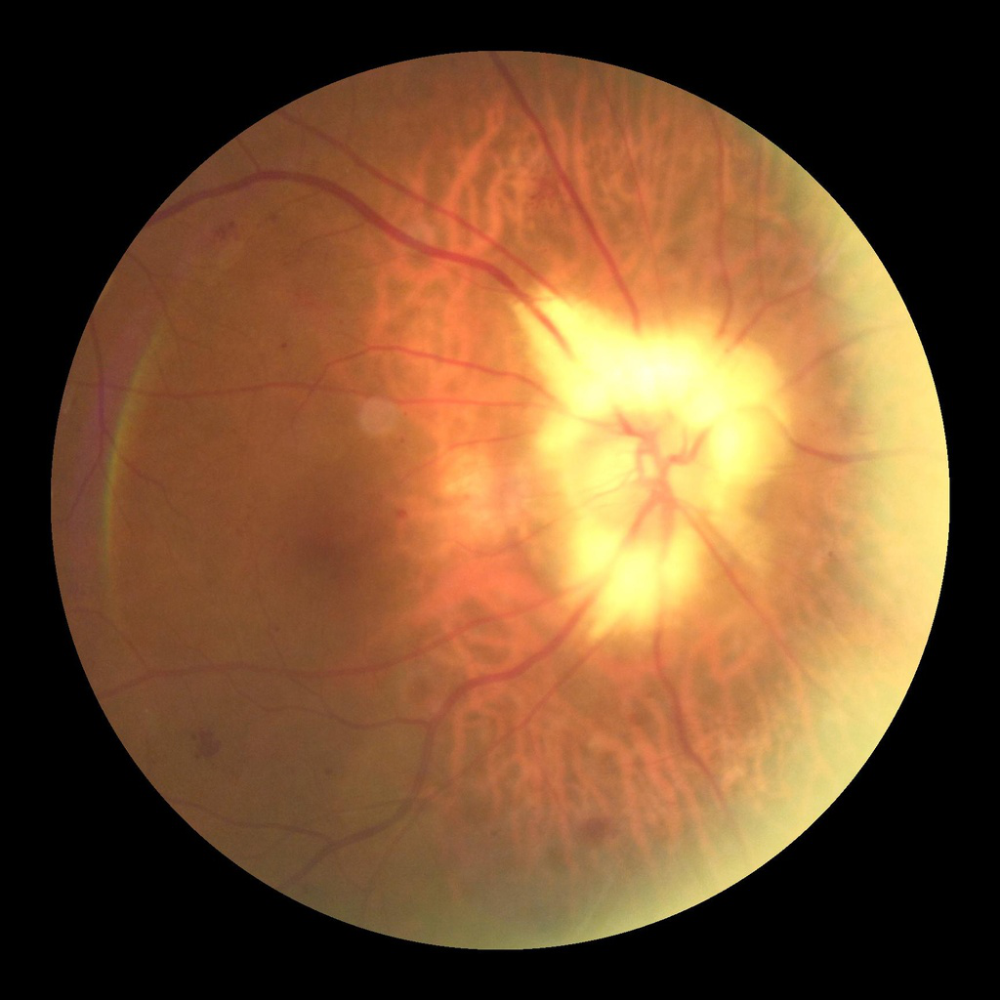

**图 2: Page 3 Img 4**

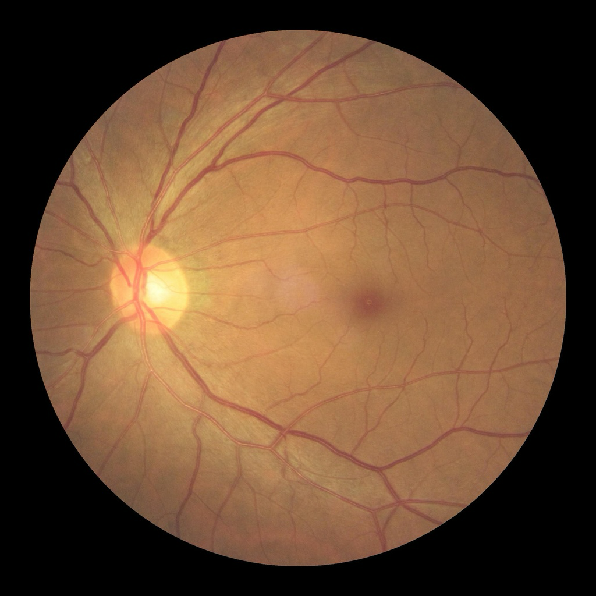

**图 3: Page 3 Img 3**

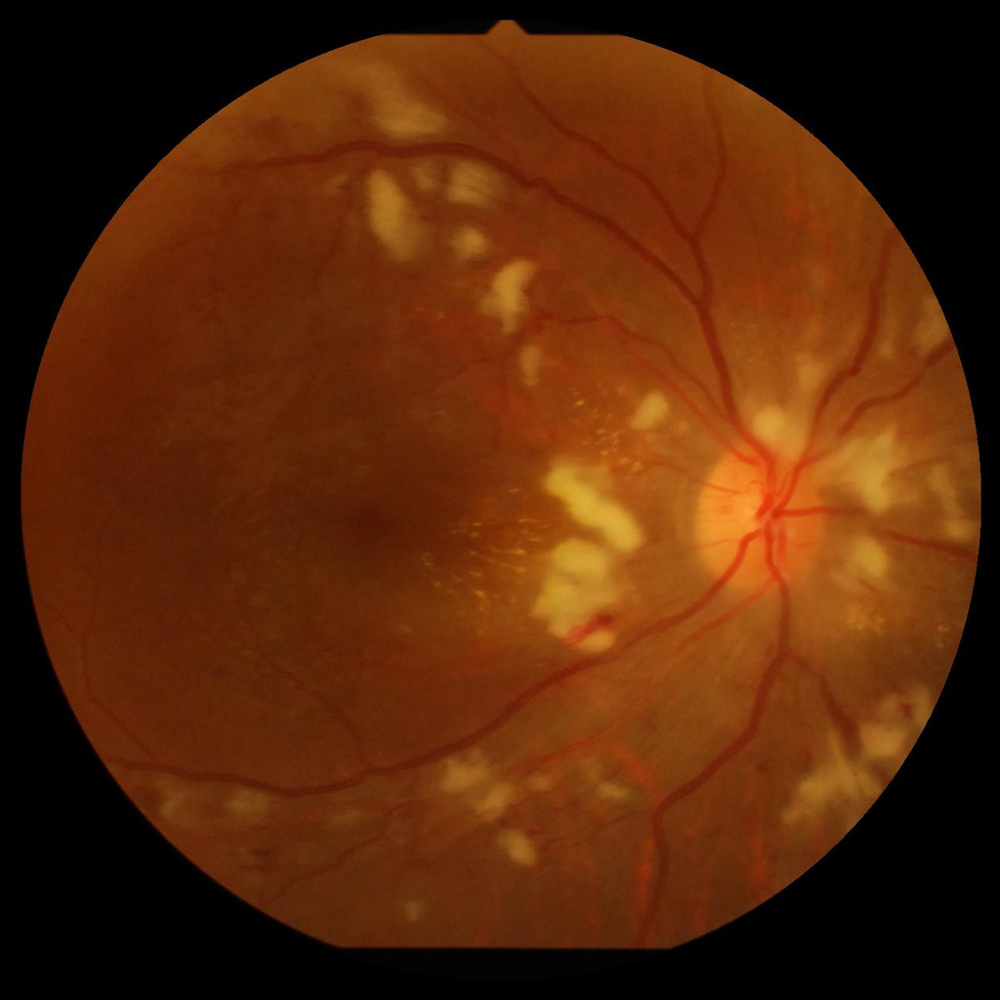

---

### 22. HiMu: Hierarchical Multimodal Frame Selection for Long Video Question Answering

**ArXiv ID**: 2603.18558v1
**作者**: Dan Ben-Ami, Gabriele Serussi, Kobi Cohen, Chaim Baskin

**链接**: [PDF](https://arxiv.org/pdf/2603.18558v1) | [Abstract](https://arxiv.org/abs/2603.18558v1)

#### 📄 原文摘要

Long-form video question answering requires reasoning over extended temporal contexts, making frame selection critical for large vision-language models (LVLMs) bound by finite context windows. Existing methods face a sharp trade-off: similarity-based selectors are fast but collapse compositional queries into a single dense vector, losing sub-event ordering and cross-modal bindings; agent-based methods recover this structure through iterative LVLM inference, but at prohibitive cost. We introduce HiMu, a training-free framework that bridges this gap. A single text-only LLM call decomposes the query into a hierarchical logic tree whose leaves are atomic predicates, each routed to a lightweight expert spanning vision (CLIP, open-vocabulary detection, OCR) and audio (ASR, CLAP). The resulting signals are normalized, temporally smoothed to align different modalities, and composed bottom-up through fuzzy-logic operators that enforce temporal sequencing and adjacency, producing a continuous satisfaction curve. Evaluations on Video-MME, LongVideoBench and HERBench-Lite show that HiMu advances the efficiency-accuracy Pareto front: at 16 frames with Qwen3-VL 8B it outperforms all competing selectors, and with GPT-4o it surpasses agentic systems operating at 32-512 frames while requiring roughly 10x fewer FLOPs.

#### 🌐 中文摘要

长格式视频问答需要对扩展的时间上下文进行推理，这使得帧选择对于受有限上下文窗口约束的大型视觉语言模型（LVLM）至关重要。现有方法面临着尖锐的权衡：基于相似性的选择器速度很快，但将组合查询折叠成单个密集向量，失去了子事件排序和跨模式绑定；基于代理的方法通过迭代 LVLM 推理来恢复这种结构，但成本高昂。我们推出了 HiMu，这是一个弥补这一差距的免培训框架。单个纯文本 LLM 调用将查询分解为分层逻辑树，其叶子是原子谓词，每个谓词都路由到跨视觉（CLIP、开放词汇检测、OCR）和音频（ASR、CLAP）的轻量级专家。 生成的信号经过归一化、时间平滑以对齐不同的模态，并通过强制时间排序和邻接的模糊逻辑算子自下而上地组合，产生连续的满意度曲线。对 Video-MME、LongVideoBench 和 HERBench-Lite 的评估表明 HiMu 提高了效率-准确度 Pareto 前沿：在 16 帧时，Qwen3-VL 8B 优于所有竞争选择器，而 GPT-4o 则超过代理系统以 32-512 帧运行，同时需要大约 10 倍的 FLOPs。

---

### 23. CoDA: Exploring Chain-of-Distribution Attacks and Post-Hoc Token-Space Repair for Medical Vision-Language Models

**ArXiv ID**: 2603.18545v1
**作者**: Xiang Chen, Fangfang Yang, Chunlei Meng, Chengyin Hu, Ang Li, Yiwei Wei, Jiahuan Long, Jiujiang Guo

**链接**: [PDF](https://arxiv.org/pdf/2603.18545v1) | [Abstract](https://arxiv.org/abs/2603.18545v1)

#### 📄 原文摘要

Medical vision--language models (MVLMs) are increasingly used as perceptual backbones in radiology pipelines and as the visual front end of multimodal assistants, yet their reliability under real clinical workflows remains underexplored. Prior robustness evaluations often assume clean, curated inputs or study isolated corruptions, overlooking routine acquisition, reconstruction, display, and delivery operations that preserve clinical readability while shifting image statistics. To address this gap, we propose CoDA, a chain-of-distribution framework that constructs clinically plausible pipeline shifts by composing acquisition-like shading, reconstruction and display remapping, and delivery and export degradations. Under masked structural-similarity constraints, CoDA jointly optimizes stage compositions and parameters to induce failures while preserving visual plausibility. Across brain MRI, chest X-ray, and abdominal CT, CoDA substantially degrades the zero-shot performance of CLIP-style MVLMs, with chained compositions consistently more damaging than any single stage. We also evaluate multimodal large language models (MLLMs) as technical-authenticity auditors of imaging realism and quality rather than pathology. Proprietary multimodal models show degraded auditing reliability and persistent high-confidence errors on CoDA-shifted samples, while the medical-specific MLLMs we test exhibit clear deficiencies in medical image quality auditing. Finally, we introduce a post-hoc repair strategy based on teacher-guided token-space adaptation with patch-level alignment, which improves accuracy on archived CoDA outputs. Overall, our findings characterize a clinically grounded threat surface for MVLM deployment and show that lightweight alignment improves robustness in deployment.

#### 🌐 中文摘要

医学视觉语言模型 (MVLM) 越来越多地用作放射学流程中的感知支柱和多模式助手的视觉前端，但它们在实际临床工作流程中的可靠性仍未得到充分探索。先前的稳健性评估通常假设干净、精心策划的输入或研究孤立的损坏，忽略了在改变图像统计数据的同时保持临床可读性的常规采集、重建、显示和交付操作。为了解决这一差距，我们提出了 CoDA，一种分布链框架，通过构成类似采集的着色、重建和显示重新映射以及传递和导出降级来构建临床上合理的管道转换。在隐藏的结构相似性约束下，CoDA 联合优化舞台组成和参数，以诱导失败，同时保持视觉合理性。 在脑部 MRI、胸部 X 射线和腹部 CT 中，CoDA 大大降低了 CLIP 式 MVLM 的零样本性能，链式组合始终比任何单阶段更具破坏性。我们还评估多模态大语言模型 (MLLM) 作为成像真实性和质量而不是病理学的技术真实性审核员。专有的多模态模型在 CoDA 转移样本上显示出审计可靠性下降和持续的高置信度错误，而我们测试的医疗专用 MLLM 在医学图像质量审计方面表现出明显的缺陷。最后，我们引入了一种基于教师指导的标记空间适应和补丁级对齐的事后修复策略，这提高了存档 CoDA 输出的准确性。总体而言，我们的研究结果描述了 MVLM 部署的基于临床的威胁面，并表明轻量级对齐提高了部署的稳健性。

---

### 24. Scaling Sim-to-Real Reinforcement Learning for Robot VLAs with Generative 3D Worlds

**ArXiv ID**: 2603.18532v1
**作者**: Andrew Choi, Xinjie Wang, Zhizhong Su, Wei Xu

**链接**: [PDF](https://arxiv.org/pdf/2603.18532v1) | [Abstract](https://arxiv.org/abs/2603.18532v1)

#### 📄 原文摘要

The strong performance of large vision-language models (VLMs) trained with reinforcement learning (RL) has motivated similar approaches for fine-tuning vision-language-action (VLA) models in robotics. Many recent works fine-tune VLAs directly in the real world to avoid addressing the sim-to-real gap. While real-world RL circumvents sim-to-real issues, it inherently limits the generality of the resulting VLA, as scaling scene and object diversity in the physical world is prohibitively difficult. This leads to the paradoxical outcome of transforming a broadly pretrained model into an overfitted, scene-specific policy. Training in simulation can instead provide access to diverse scenes, but designing those scenes is also costly. In this work, we show that VLAs can be RL fine-tuned without sacrificing generality and with reduced labor by leveraging 3D world generative models. Using these models together with a language-driven scene designer, we generate hundreds of diverse interactive scenes containing unique objects and backgrounds, enabling scalable and highly parallel policy learning. Starting from a pretrained imitation baseline, our approach increases simulation success from 9.7% to 79.8% while achieving a 1.25$\times$ speedup in task completion time. We further demonstrate successful sim-to-real transfer enabled by the quality of the generated digital twins together with domain randomization, improving real-world success from 21.7% to 75% and achieving a 1.13$\times$ speedup. Finally, we further highlight the benefits of leveraging the effectively unlimited data from 3D world generative models through an ablation study showing that increasing scene diversity directly improves zero-shot generalization.

#### 🌐 中文摘要

通过强化学习 (RL) 训练的大型视觉语言模型 (VLM) 的强大性能激发了在机器人技术中微调视觉语言动作 (VLA) 模型的类似方法。许多最近的工作直接在现实世界中微调 VLA，以避免解决模拟与真实之间的差距。虽然现实世界的强化学习规避了模拟到真实的问题，但它本质上限制了由此产生的 VLA 的通用性，因为扩展物理世界中的场景和对象多样性非常困难。这导致了将广泛预训练的模型转变为过度拟合的特定场景策略的矛盾结果。相反，模拟训练可以提供对不同场景的访问，但设计这些场景的成本也很高。在这项工作中，我们展示了通过利用 3D 世界生成模型，可以在不牺牲通用性的情况下对 VLA 进行 RL 微调，并减少劳动力。 将这些模型与语言驱动的场景设计器结合使用，我们生成了数百个包含独特对象和背景的不同交互式场景，从而实现了可扩展且高度并行的策略学习。从预训练的模仿基线开始，我们的方法将模拟成功率从 9.7% 提高到 79.8%，同时在任务完成时间上实现了 1.25 美元\倍的加速。我们进一步展示了通过生成的数字孪生的质量和域随机化实现的成功的模拟到真实的传输，将现实世界的成功率从 21.7% 提高到 75%，并实现了 1.13$\times$ 的加速。最后，我们进一步强调了通过消融研究利用来自 3D 世界生成模型的有效无限数据的好处，该研究表明增加场景多样性可以直接提高零样本泛化能力。

#### 🏗️ 核心架构

以下为论文中体现核心架构的关键图表：

**图 1: Page 1 Img 2**

**图 2: Page 1 Img 15**

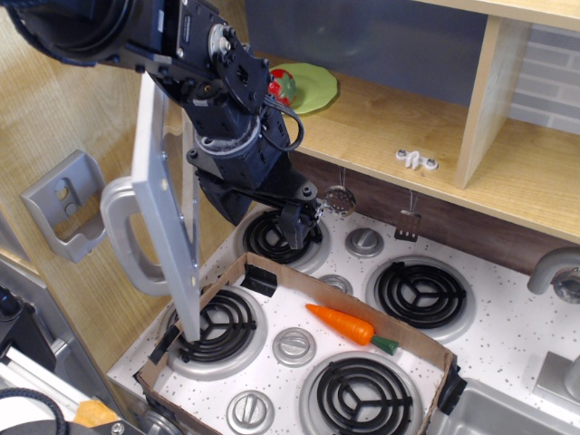

**图 3: Page 1 Img 14**

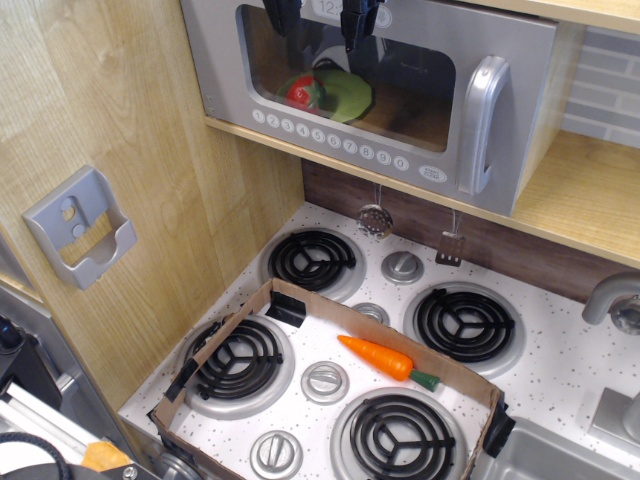

---

### 25. Counting Circuits: Mechanistic Interpretability of Visual Reasoning in Large Vision-Language Models

**ArXiv ID**: 2603.18523v1
**作者**: Liwei Che, Zhiyu Xue, Yihao Quan, Benlin Liu, Zeru Shi, Michelle Hurst, Jacob Feldman, Ruixiang Tang, Ranjay Krishna, Vladimir Pavlovic

**链接**: [PDF](https://arxiv.org/pdf/2603.18523v1) | [Abstract](https://arxiv.org/abs/2603.18523v1)

#### 📄 原文摘要

Counting serves as a simple but powerful test of a Large Vision-Language Model's (LVLM's) reasoning; it forces the model to identify each individual object and then add them all up. In this study, we investigate how LVLMs implement counting using controlled synthetic and real-world benchmarks, combined with mechanistic analyses. Our results show that LVLMs display a human-like counting behavior, with precise performance on small numerosities and noisy estimation for larger quantities. We introduce two novel interpretability methods, Visual Activation Patching and HeadLens, and use them to uncover a structured "counting circuit" that is largely shared across a variety of visual reasoning tasks. Building on these insights, we propose a lightweight intervention strategy that exploits simple and abundantly available synthetic images to fine-tune arbitrary pretrained LVLMs exclusively on counting. Despite the narrow scope of this fine-tuning, the intervention not only enhances counting accuracy on in-distribution synthetic data, but also yields an average improvement of +8.36% on out-of-distribution counting benchmarks and an average gain of +1.54% on complex, general visual reasoning tasks for Qwen2.5-VL. These findings highlight the central, influential role of counting in visual reasoning and suggest a potential pathway for improving overall visual reasoning capabilities through targeted enhancement of counting mechanisms.

#### 🌐 中文摘要

计数是对大型视觉语言模型 (LVLM) 推理的简单但强大的测试；它迫使模型识别每个单独的对象，然后将它们全部加起来。在这项研究中，我们研究了 LVLM 如何使用受控合成和现实世界基准并结合机械分析来实现计数。我们的结果表明，LVLM 表现出类似人类的计数行为，在小数值上具有精确的性能，在较大数量时具有噪声估计。我们引入了两种新颖的可解释性方法：视觉激活修补和 HeadLens，并使用它们来揭示一个结构化的“计数电路”，该电路在各种视觉推理任务中很大程度上共享。基于这些见解，我们提出了一种轻量级干预策略，该策略利用简单且丰富的可用合成图像来专门根据计数来微调任意预训练的 LVLM。 尽管这种微调的范围很窄，但干预措施不仅提高了分布内合成数据的计数准确性，而且使 Qwen2.5-VL 的分布外计数基准平均提高了 +8.36%，在复杂、一般的视觉推理任务上平均增益 +1.54%。这些发现强调了计数在视觉推理中的核心、有影响力的作用，并提出了通过有针对性地增强计数机制来提高整体视觉推理能力的潜在途径。

#### 🏗️ 核心架构

以下为论文中体现核心架构的关键图表：

**图 1: Page 5 Img 9**

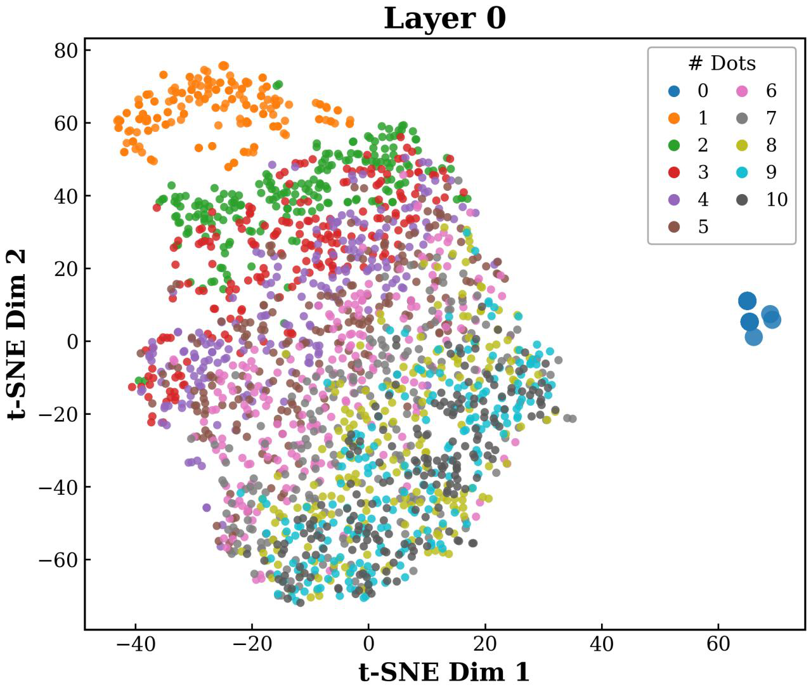

**图 2: Page 5 Img 1**

**图 3: Page 5 Img 8**

---

### 26. Robotic Agentic Platform for Intelligent Electric Vehicle Disassembly

**ArXiv ID**: 2603.18520v1
**作者**: Zachary Allen, Max Conway, Lyle Antieau, Allen Ponraj, Nikolaus Correll

**链接**: [PDF](https://arxiv.org/pdf/2603.18520v1) | [Abstract](https://arxiv.org/abs/2603.18520v1)

#### 📄 原文摘要

Electric vehicles (EV) create an urgent need for scalable battery recycling, yet disassembly of EV battery packs remains largely manual due to high design variability. We present our Robotic Agentic Platform for Intelligent Disassembly (RAPID), designed to investigate perception-driven manipulation, flexible automation, and AI-assisted robot programming in realistic recycling scenarios. The system integrates a gantry-mounted industrial manipulator, RGB-D perception, and an automated nut-running tool for fastener removal on a full-scale EV battery pack. An open-vocabulary object detection pipeline achieves 0.9757 mAP50, enabling reliable identification of screws, nuts, busbars, and other components. We experimentally evaluate (n=204) three one-shot fastener removal strategies: taught-in poses (97% success rate, 24 min duration), one-shot vision execution (57%, 29 min), and visual servoing (83%, 36 min), comparing success rate and disassembly time for the battery's top cover fasteners. To support flexible interaction, we introduce agentic AI specifications for robotic disassembly tasks, allowing LLM agents to translate high-level instructions into robot actions through structured tool interfaces and ROS services. We evaluate SmolAgents with GPT-4o-mini and Qwen 3.5 9B/4B on edge hardware. Tool-based interfaces achieve 100% task completion, while automatic ROS service discovery shows 43.3% failure rates, highlighting the need for structured robot APIs for reliable LLM-driven control. This open-source platform enables systematic investigation of human-robot collaboration, agentic robot programming, and increasingly autonomous disassembly workflows, providing a practical foundation for research toward scalable robotic battery recycling.

#### 🌐 中文摘要

电动汽车 (EV) 迫切需要可扩展的电池回收，但由于设计的高度可变性，电动汽车电池组的拆卸仍然主要是手动的。我们推出了智能拆卸机器人代理平台 (RAPID)，旨在研究现实回收场景中的感知驱动操作、灵活自动化和人工智能辅助机器人编程。该系统集成了龙门式工业机械手、RGB-D 感知和自动螺母拧紧工具，用于拆卸全尺寸电动汽车电池组上的紧固件。开放词汇目标检测管道达到 0.9757 mAP50，能够可靠地识别螺钉、螺母、母线和其他组件。我们通过实验评估 (n=204) 三种一次性紧固件拆卸策略：示教姿势（97% 成功率，持续时间 24 分钟）、一次性视觉执行（57%，29 分钟）和视觉伺服（83%，36 分钟），比较电池顶盖紧固件的成功率和拆卸时间。 为了支持灵活的交互，我们为机器人拆卸任务引入了代理AI规范，允许LLM代理通过结构化工具接口和ROS服务将高级指令转换为机器人动作我们在边缘硬件上使用GPT-4o-mini和Qwen 3.5 9B/4B评估SmolAgents。基于工具的接口实现了 100% 的任务完成，而自动 ROS 服务发现的失败率高达 43.3%，这突出表明需要结构化机器人 API 来实现可靠的 LLM 驱动控制。这个开源平台可以对人机协作、代理机器人编程和日益自主的拆卸工作流程进行系统研究，为可扩展的机器人电池回收研究提供实用基础。

#### 🏗️ 核心架构

以下为论文中体现核心架构的关键图表：

**图 1: Page 6 Img 1**

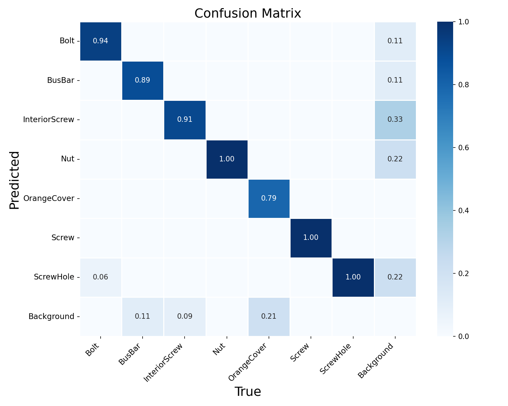

---

### 27. Foundations and Architectures of Artificial Intelligence for Motor Insurance

**ArXiv ID**: 2603.18508v1
**作者**: Teerapong Panboonyuen

**链接**: [PDF](https://arxiv.org/pdf/2603.18508v1) | [Abstract](https://arxiv.org/abs/2603.18508v1)

#### 📄 原文摘要

This handbook presents a systematic treatment of the foundations and architectures of artificial intelligence for motor insurance, grounded in large-scale real-world deployment. It formalizes a vertically integrated AI paradigm that unifies perception, multimodal reasoning, and production infrastructure into a cohesive intelligence stack for automotive risk assessment and claims processing. At its core, the handbook develops domain-adapted transformer architectures for structured visual understanding, relational vehicle representation learning, and multimodal document intelligence, enabling end-to-end automation of vehicle damage analysis, claims evaluation, and underwriting workflows. These components are composed into a scalable pipeline operating under practical constraints observed in nationwide motor insurance systems in Thailand. Beyond model design, the handbook emphasizes the co-evolution of learning algorithms and MLOps practices, establishing a principled framework for translating modern artificial intelligence into reliable, production-grade systems in high-stakes industrial environments.

#### 🌐 中文摘要

本手册系统地介绍了汽车保险人工智能的基础和架构，以大规模的现实世界部署为基础。它正式形成了垂直集成的人工智能范式，将感知、多模态推理和生产基础设施统一到一个用于汽车风险评估和索赔处理的紧密结合的智能堆栈中。该手册的核心是开发适应领域的变压器架构，用于结构化视觉理解、关系车辆表示学习和多模式文档智能，从而实现车辆损坏分析、索赔评估和承保工作流程的端到端自动化。这些组件组成了一个可扩展的管道，在泰国全国汽车保险系统中观察到的实际限制下运行。 除了模型设计之外，该手册还强调学习算法和 MLOps 实践的共同进化，建立一个原则框架，将现代人工智能转化为高风险工业环境中可靠的生产级系统。

---

### 28. Cross-Domain Demo-to-Code via Neurosymbolic Counterfactual Reasoning

**ArXiv ID**: 2603.18495v1
**作者**: Jooyoung Kim, Wonje Choi, Younguk Song, Honguk Woo

**链接**: [PDF](https://arxiv.org/pdf/2603.18495v1) | [Abstract](https://arxiv.org/abs/2603.18495v1)

#### 📄 原文摘要

Recent advances in Vision-Language Models (VLMs) have enabled video-instructed robotic programming, allowing agents to interpret video demonstrations and generate executable control code. We formulate video-instructed robotic programming as a cross-domain adaptation problem, where perceptual and physical differences between demonstration and deployment induce procedural mismatches. However, current VLMs lack the procedural understanding needed to reformulate causal dependencies and achieve task-compatible behavior under such domain shifts. We introduce NeSyCR, a neurosymbolic counterfactual reasoning framework that enables verifiable adaptation of task procedures, providing a reliable synthesis of code policies. NeSyCR abstracts video demonstrations into symbolic trajectories that capture the underlying task procedure. Given deployment observations, it derives counterfactual states that reveal cross-domain incompatibilities. By exploring the symbolic state space with verifiable checks, NeSyCR proposes procedural revisions that restore compatibility with the demonstrated procedure. NeSyCR achieves a 31.14% improvement in task success over the strongest baseline Statler, showing robust cross-domain adaptation across both simulated and real-world manipulation tasks.

#### 🌐 中文摘要

视觉语言模型（VLM）的最新进展使得视频指导的机器人编程成为可能，允许智能体解释视频演示并生成可执行的控制代码。我们将视频指导的机器人编程表述为跨域适应问题，其中演示和部署之间的感知和物理差异会导致程序不匹配。然而，当前的 VLM 缺乏重新表述因果依赖性和在此类领域转变下实现任务兼容行为所需的程序理解。我们引入了 NeSyCR，这是一种神经符号反事实推理框架，可以对任务过程进行可验证的调整，从而提供可靠的代码策略综合。 NeSyCR 将视频演示抽象为捕捉底层任务过程的符号轨迹。根据部署观察，它得出反事实状态，揭示跨域不兼容性。 通过通过可验证的检查探索符号状态空间，NeSyCR 提出了程序修订，恢复了与演示程序的兼容性NeSyCR 的任务成功率比最强的基线 Statler 提高了 31.14%，在模拟和现实世界的操作任务中显示出强大的跨域适应能力。

#### 🏗️ 核心架构

以下为论文中体现核心架构的关键图表：

**图 1: Page 2 Img 4**

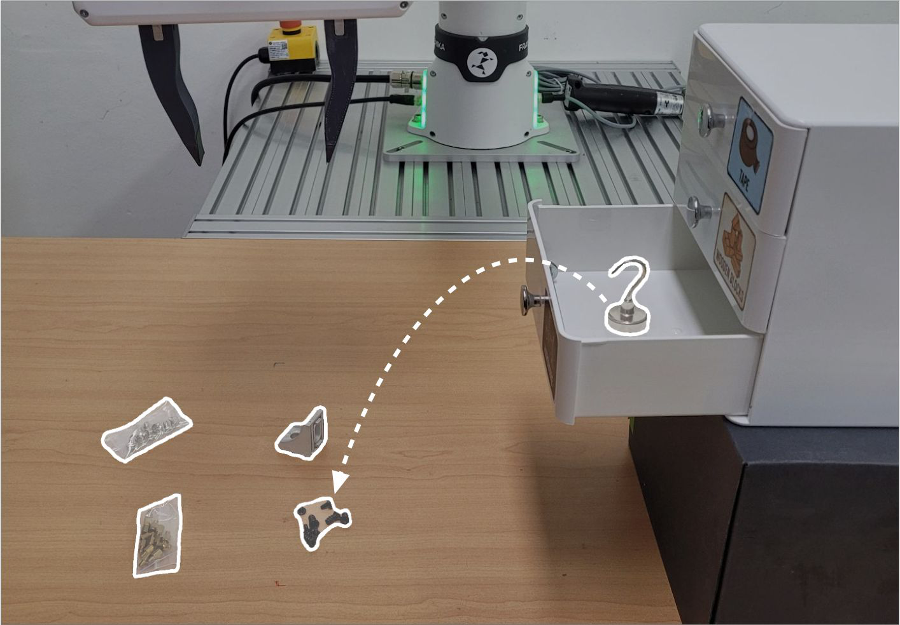

**图 2: Page 2 Img 1**

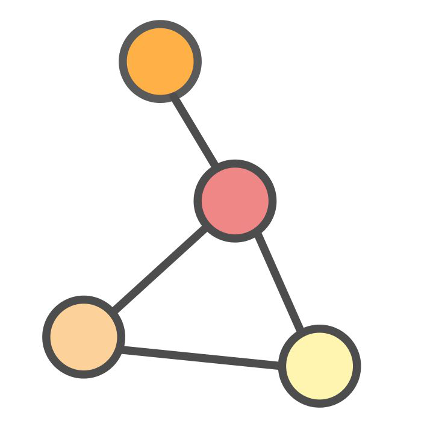

**图 3: Page 2 Img 21**

---

### 29. MemoAct: Atkinson-Shiffrin-Inspired Memory-Augmented Visuomotor Policy for Robotic Manipulation

**ArXiv ID**: 2603.18494v1
**作者**: Liufan Tan, Jiale Li, Gangshan Jing

**链接**: [PDF](https://arxiv.org/pdf/2603.18494v1) | [Abstract](https://arxiv.org/abs/2603.18494v1)

#### 📄 原文摘要

Memory-augmented robotic policies are essential in handling memory-dependent tasks. However, existing approaches typically rely on simple observation window extensions, struggling to simultaneously achieve precise task state tracking and robust long-horizon retention. To overcome these challenges, inspired by the Atkinson-Shiffrin memory model, we propose MemoAct, a hierarchical memory-based policy that leverages distinct memory tiers to tackle specific bottlenecks. Specifically, lossless short-term memory ensures precise task state tracking, while compressed long-term memory enables robust long-horizon retention. To enrich the evaluation landscape, we construct MemoryRTBench based on RoboTwin 2.0, specifically tailored to assess policy capabilities in task state tracking and long-horizon retention. Extensive experiments across simulated and real-world scenarios demonstrate that MemoAct achieves superior performance compared to both existing Markovian baselines and history-aware policies. The project page is \href{https://tlf-tlf.github.io/MemoActPage/}{available}.

#### 🌐 中文摘要

记忆增强的机器人策略对于处理依赖于记忆的任务至关重要然而，现有的方法通常依赖于简单的观察窗口扩展，难以同时实现精确的任务状态跟踪和强大的长视野保留。为了克服这些挑战，受 Atkinson-Shiffrin 内存模型的启发，我们提出了 MemoAct，这是一种基于分层内存的策略，利用不同的内存层来解决特定的瓶颈。具体来说，无损短期记忆可确保精确的任务状态跟踪，而压缩长期记忆可实现强大的长期保留。为了丰富评估环境，我们基于 RoboTwin 2.0 构建了 MemoryRTBench，专门用于评估任务状态跟踪和长期保留方面的策略能力。跨模拟和现实场景的大量实验表明，与现有的马尔可夫基线和历史感知策略相比，MemoAct 实现了卓越的性能。 项目页面为 \href{https://tlf-tlf.github.io/MemoActPage/}{available}。

#### 🏗️ 核心架构

以下为论文中体现核心架构的关键图表：

**图 1: Page 7 Img 1**

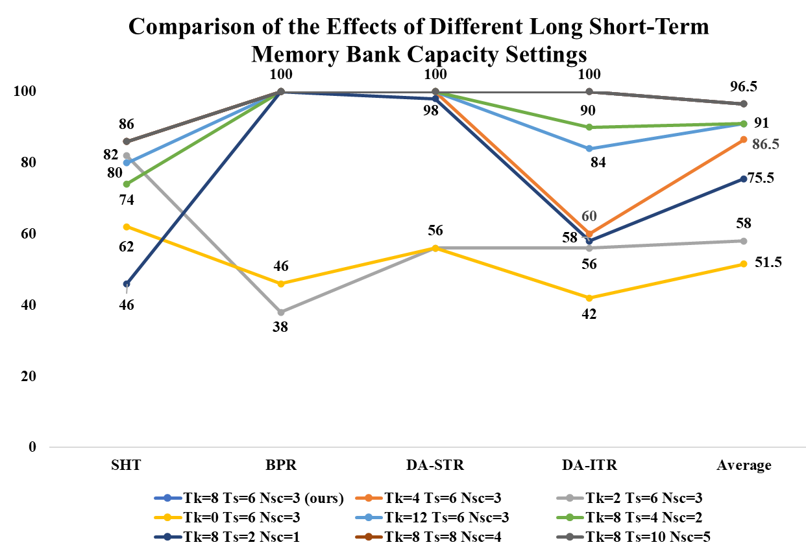

---

### 30. Do Vision Language Models Understand Human Engagement in Games?

**ArXiv ID**: 2603.18480v1
**作者**: Ziyi Wang, Qizan Guo, Rishitosh Singh, Xiyang Hu

**链接**: [PDF](https://arxiv.org/pdf/2603.18480v1) | [Abstract](https://arxiv.org/abs/2603.18480v1)

#### 📄 原文摘要

Inferring human engagement from gameplay video is important for game design and player-experience research, yet it remains unclear whether vision--language models (VLMs) can infer such latent psychological states from visual cues alone. Using the GameVibe Few-Shot dataset across nine first-person shooter games, we evaluate three VLMs under six prompting strategies, including zero-shot prediction, theory-guided prompts grounded in Flow, GameFlow, Self-Determination Theory, and MDA, and retrieval-augmented prompting. We consider both pointwise engagement prediction and pairwise prediction of engagement change between consecutive windows. Results show that zero-shot VLM predictions are generally weak and often fail to outperform simple per-game majority-class baselines. Memory- or retrieval-augmented prompting improves pointwise prediction in some settings, whereas pairwise prediction remains consistently difficult across strategies. Theory-guided prompting alone does not reliably help and can instead reinforce surface-level shortcuts. These findings suggest a perception--understanding gap in current VLMs: although they can recognize visible gameplay cues, they still struggle to robustly infer human engagement across games.

#### 🌐 中文摘要

从游戏视频中推断人类参与度对于游戏设计和玩家体验研究非常重要，但目前尚不清楚视觉语言模型 (VLM) 是否可以仅从视觉线索推断出此类潜在心理状态。我们使用九个第一人称射击游戏的 GameVibe Few-Shot 数据集，评估了六种提示策略下的三个 VLM，包括零镜头预测、基于 Flow、GameFlow、自我决定理论和 MDA 的理论引导提示，以及检索增强提示。我们考虑连续窗口之间的逐点参与度预测和参与度变化的成对预测。结果表明，零样本 VLM 预测通常很弱，并且常常无法超越简单的每场比赛多数类基线。记忆或检索增强提示可以改善某些设置中的逐点预测，而跨策略的成对预测仍然很困难。 单独的理论引导提示并不能可靠地提供帮助，反而可以强化表面的捷径。这些发现表明，当前 VLM 中存在感知理解差距：尽管它们可以识别可见的游戏玩法线索，但它们仍然难以可靠地推断人类在游戏中的参与度。

#### 🏗️ 核心架构

以下为论文中体现核心架构的关键图表：

**图 1: Page 4 Img 12**

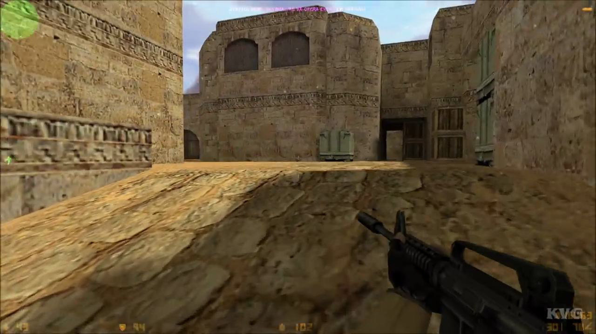

**图 2: Page 4 Img 10**

**图 3: Page 4 Img 14**

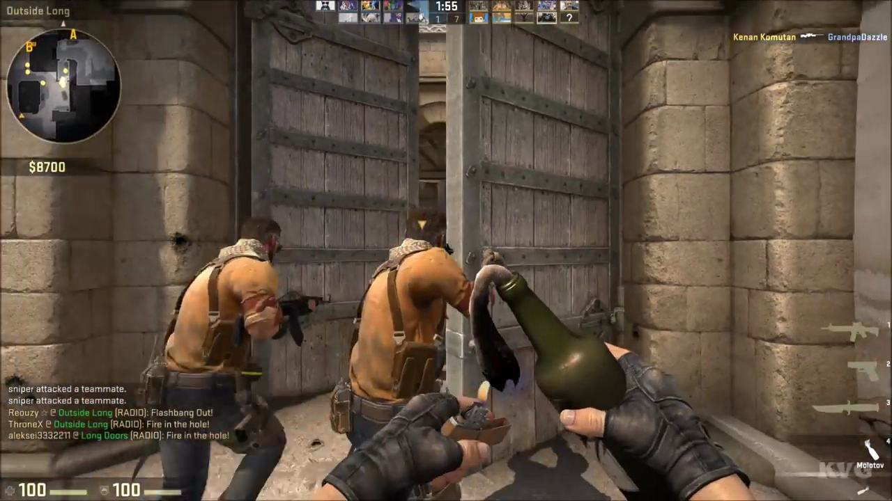

---

### 31. Cognitive Mismatch in Multimodal Large Language Models for Discrete Symbol Understanding

**ArXiv ID**: 2603.18472v1
**作者**: Yinghui Li, Jiayi Kuang, Peng Xing, Daixian Liu, Junnan Dong, Shu-Yu Guo, Yangning Li, Qingyu Zhou, Wenhao Jiang, Hai-Tao Zheng, Ying Shen, Liang Lin, Philip S. Yu

**链接**: [PDF](https://arxiv.org/pdf/2603.18472v1) | [Abstract](https://arxiv.org/abs/2603.18472v1)

#### 📄 原文摘要

While Multimodal Large Language Models (MLLMs) have achieved remarkable success in interpreting natural scenes, their ability to process discrete symbols -- the fundamental building blocks of human cognition -- remains a critical open question. Unlike continuous visual data, symbols such as mathematical formulas, chemical structures, and linguistic characters require precise, deeper interpretation. This paper introduces a comprehensive benchmark to evaluate how top-tier MLLMs navigate these "discrete semantic spaces" across five domains: language, culture, mathematics, physics, and chemistry. Our investigation uncovers a counterintuitive phenomenon: models often fail at basic symbol recognition yet succeed in complex reasoning tasks, suggesting they rely on linguistic probability rather than true visual perception. By exposing this "cognitive mismatch", we highlight a significant gap in current AI capabilities: the struggle to truly perceive and understand the symbolic languages that underpin scientific discovery and abstract thought. This work offers a roadmap for developing more rigorous, human-aligned intelligent systems.

#### 🌐 中文摘要

虽然多模态大语言模型 (MLLM) 在解释自然场景方面取得了显着的成功，但它们处理离散符号（人类认知的基本构建模块）的能力仍然是一个关键的悬而未决的问题。与连续视觉数据不同，数学公式、化学结构和语言字符等符号需要精确、更深入的解释。本文介绍了一个综合基准来评估顶级 MLLM 如何跨五个领域驾驭这些“离散语义空间”：语言、文化、数学、物理和化学。我们的研究发现了一个违反直觉的现象：模型经常在基本符号识别方面失败，但在复杂的推理任务中却取得了成功，这表明它们依赖于语言概率而不是真实的视觉感知。 通过揭露这种“认知不匹配”，我们强调了当前人工智能能力的显着差距：真正感知和理解支撑科学发现和抽象思维的符号语言的努力。这项工作为开发更严格、更人性化的智能系统提供了路线图。

#### 🏗️ 核心架构

以下为论文中体现核心架构的关键图表：

**图 1: Page 2 Img 3**

**图 2: Page 2 Img 4**

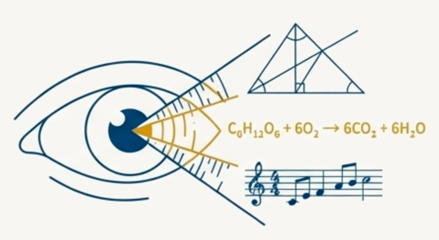

**图 3: Page 2 Img 7**

---

### 32. AlignMamba-2: Enhancing Multimodal Fusion and Sentiment Analysis with Modality-Aware Mamba

**ArXiv ID**: 2603.18462v1
**作者**: Yan Li, Yifei Xing, Xiangyuan Lan, Xin Li, Haifeng Chen, Dongmei Jiang

**链接**: [PDF](https://arxiv.org/pdf/2603.18462v1) | [Abstract](https://arxiv.org/abs/2603.18462v1)

#### 📄 原文摘要

In the era of large-scale pre-trained models, effectively adapting general knowledge to specific affective computing tasks remains a challenge, particularly regarding computational efficiency and multimodal heterogeneity. While Transformer-based methods have excelled at modeling inter-modal dependencies, their quadratic computational complexity limits their use with long-sequence data. Mamba-based models have emerged as a computationally efficient alternative; however, their inherent sequential scanning mechanism struggles to capture the global, non-sequential relationships that are crucial for effective cross-modal alignment. To address these limitations, we propose \textbf{AlignMamba-2}, an effective and efficient framework for multimodal fusion and sentiment analysis. Our approach introduces a dual alignment strategy that regularizes the model using both Optimal Transport distance and Maximum Mean Discrepancy, promoting geometric and statistical consistency between modalities without incurring any inference-time overhead. More importantly, we design a Modality-Aware Mamba layer, which employs a Mixture-of-Experts architecture with modality-specific and modality-shared experts to explicitly handle data heterogeneity during the fusion process. Extensive experiments on four challenging benchmarks, including dynamic time-series (on the CMU-MOSI and CMU-MOSEI datasets) and static image-related tasks (on the NYU-Depth V2 and MVSA-Single datasets), demonstrate that AlignMamba-2 establishes a new state-of-the-art in both effectiveness and efficiency across diverse pattern recognition tasks, ranging from dynamic time-series analysis to static image-text classification.

#### 🌐 中文摘要

在大规模预训练模型时代，有效地将一般知识适应特定的情感计算任务仍然是一个挑战，特别是在计算效率和多模态异构性方面。虽然基于 Transformer 的方法在建模模态间依赖性方面表现出色，但其二次计算复杂性限制了它们在长序列数据中的使用。基于 Mamba 的模型已成为计算高效的替代方案；然而，它们固有的顺序扫描机制很难捕获对于有效的跨模式对齐至关重要的全局非顺序关系。为了解决这些限制，我们提出了 \textbf{AlignMamba-2}，这是一种有效且高效的多模态融合和情感分析框架。 我们的方法引入了双重对齐策略，使用最佳传输距离和最大平均差异对模型进行正则化，促进模态之间的几何和统计一致性，而不会产生任何推理时间开销。更重要的是，我们设计了模态感知 Mamba 层，它采用具有特定模态和模态共享专家的专家混合架构，以在融合过程中显式处理数据异构性。对四个具有挑战性的基准（包括动态时间序列（在 CMU-MOSI 和 CMU-MOSEI 数据集上）和静态图像相关任务（在 NYU-Depth V2 和 MVSA-Single 数据集上））进行的广泛实验表明，AlignMamba-2 在各种模式识别任务（从动态时间序列分析到静态图像文本分类）的有效性和效率方面建立了新的最先进技术。

#### 🏗️ 核心架构

以下为论文中体现核心架构的关键图表：

**图 1: Page 6 Img 1**

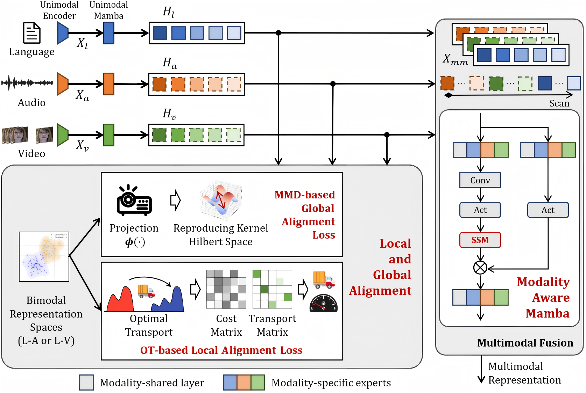

**图 2: Page 8 Img 1**

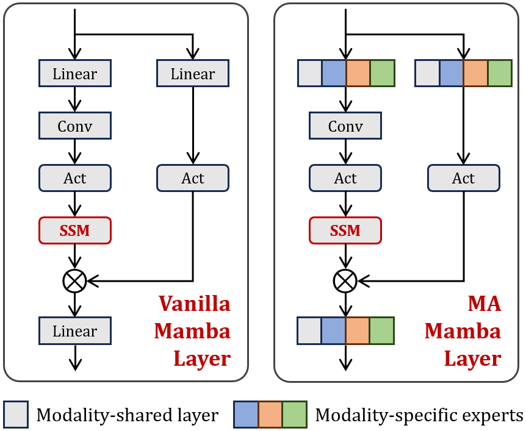

**图 3: Page 2 Img 1**

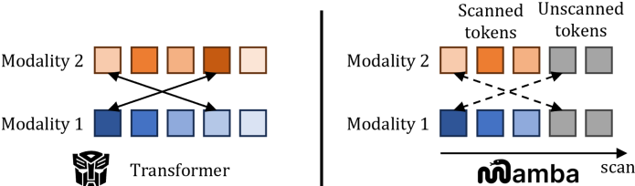

---

### 33. Discounted Beta--Bernoulli Reward Estimation for Sample-Efficient Reinforcement Learning with Verifiable Rewards

**ArXiv ID**: 2603.18444v1
**作者**: Haechan Kim, Soohyun Ryu, Gyouk Chu, Doohyuk Jang, Eunho Yang

**链接**: [PDF](https://arxiv.org/pdf/2603.18444v1) | [Abstract](https://arxiv.org/abs/2603.18444v1)

#### 📄 原文摘要

Reinforcement learning with verifiable rewards (RLVR) has emerged as an effective post-training paradigm for improving the reasoning capabilities of large language models. However, existing group-based RLVR methods often suffer from severe sample inefficiency. This inefficiency stems from reliance on point estimation of rewards from a small number of rollouts, leading to high estimation variance, variance collapse, and ineffective utilization of generated responses. In this work, we reformulate RLVR from a statistical estimation perspective by modeling rewards as samples drawn from a policy-induced distribution and casting advantage computation as the problem of estimating the reward distribution from finite data. Building on this view, we propose Discounted Beta--Bernoulli (DBB) reward estimation, which leverages historical reward statistics for the non-stationary distribution. Although biased, the resulting estimator exhibits reduced and stable variance, theoretically avoids estimated variance collapse, and achieves lower mean squared error than standard point estimation. Extensive experiments across six in-distribution and three out-of-distribution reasoning benchmarks demonstrate that GRPO with DBB consistently outperforms naive GRPO, achieving average Acc@8 improvements of 3.22/2.42 points in-distribution and 12.49/6.92 points out-of-distribution on the 1.7B and 8B models, respectively, without additional computational cost or memory usage.

#### 🌐 中文摘要

具有可验证奖励的强化学习（RLVR）已成为提高大型语言模型推理能力的有效后训练范例。然而，现有的基于群体的 RLVR 方法往往存在严重的样本效率低下问题。这种低效率源于对少量推出的奖励点估计的依赖，导致高估计方差、方差崩溃以及生成响应的无效利用。在这项工作中，我们从统计估计的角度重新表述了 RLVR，将奖励建模为从策略诱导的分布中抽取的样本，并将优势计算视为根据有限数据估计奖励分布的问题。基于这一观点，我们提出了折扣贝塔-伯努利（DBB）奖励估计，它利用非平稳分布的历史奖励统计数据。 尽管有偏差，所得估计器表现出减少且稳定的方差，理论上避免了估计方差崩溃，并实现了比标准点估计更低的均方误差。跨越六个分布内和三个分布外推理基准的广泛实验表明，带有 DBB 的 GRPO 始终优于朴素 GRPO，实现平均 Acc@8 分布内 3.22/2.42 点和 12.49/6.92 点的改进分别在 1.7B 和 8B 模型上实现分布外，无需额外的计算成本或内存使用。

#### 🏗️ 核心架构

以下为论文中体现核心架构的关键图表：

**图 1: Page 2 Img 1**

**图 2: Page 2 Img 3**

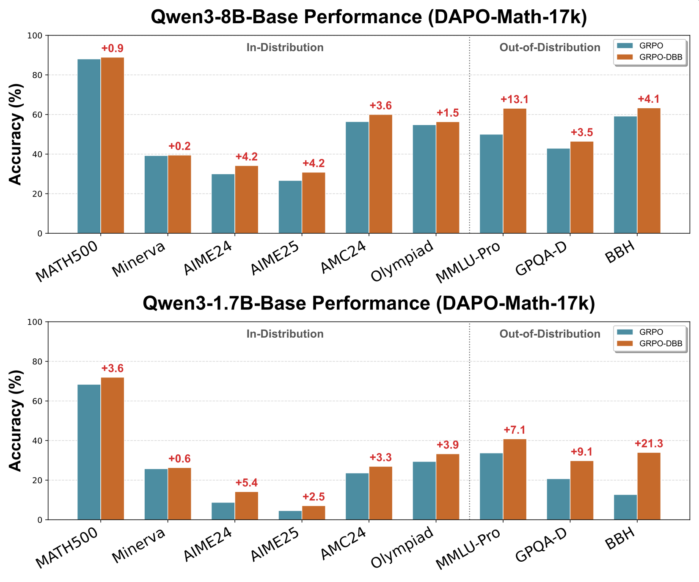

**图 3: Page 2 Img 2**

---

### 34. Adaptive Decoding via Test-Time Policy Learning for Self-Improving Generation

**ArXiv ID**: 2603.18428v1
**作者**: Asmita Bhardwaj, Yuya Jeremy Ong, Eelaaf Zahid, Basel Shbita

**链接**: [PDF](https://arxiv.org/pdf/2603.18428v1) | [Abstract](https://arxiv.org/abs/2603.18428v1)

#### 📄 原文摘要

Decoding strategies largely determine the quality of Large Language Model (LLM) outputs, yet widely used heuristics such as greedy or fixed temperature/top-p decoding are static and often task-agnostic, leading to suboptimal or inconsistent generation quality across domains that demand stylistic or structural flexibility. We introduce a reinforcement learning-based decoder sampler that treats decoding as sequential decision-making and learns a lightweight policy to adjust sampling parameters at test-time while keeping LLM weights frozen. We evaluated summarization datasets including BookSum, arXiv, and WikiHow using Granite-3.3-2B and Qwen-2.5-0.5B. Our policy sampler consistently outperforms greedy and static baselines, achieving relative gains of up to +88% (BookSum, Granite) and +79% (WikiHow, Qwen). Reward ablations show that overlap-only objectives underperform compared to composite rewards, while structured shaping terms (length, coverage, repetition, completeness) enable stable and sustained improvements. These findings highlight reinforcement learning as a practical mechanism for test-time adaptation in decoding, enabling domain-aware and user-controllable generation without retraining large models.

#### 🌐 中文摘要

解码策略在很大程度上决定了大语言模型（LLM）输出的质量，但广泛使用的启发式算法（例如贪婪或固定温度/top-p解码）是静态的，并且通常与任务无关，导致在需要风格或结构灵活性的领域中产生次优或不一致的生成质量。我们引入了一种基于强化学习的解码器采样器，它将解码视为顺序决策，并学习轻量级策略以在测试时调整采样参数，同时保持LLM权重冻结。我们使用 Granite-3.3-2B 和 Qwen-2.5-0.5B 评估了包括 BookSum、arXiv 和 WikiHow 在内的摘要数据集。我们的策略采样器始终优于贪婪和静态基线，实现高达 +88%（BookSum、Granite）和 +79%（WikiHow、Qwen）的相对收益。 奖励消融表明，与复合奖励相比，仅重叠的目标表现不佳，而结构化塑造术语（长度、覆盖范围、重复、完整性）可实现稳定和持续的改进这些发现强调强化学习作为解码中测试时间适应的实用机制，无需重新训练大型模型即可实现领域感知和用户可控的生成。

#### 🏗️ 核心架构

以下为论文中体现核心架构的关键图表：

**图 1: Page 3 Img 1**

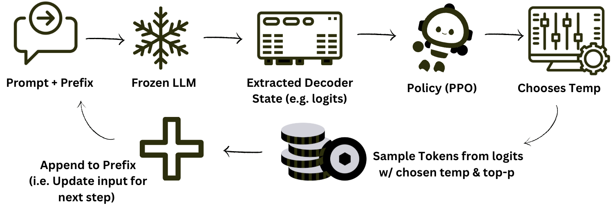

---

### 35. Mind the Rarities: Can Rare Skin Diseases Be Reliably Diagnosed via Diagnostic Reasoning?

**ArXiv ID**: 2603.18418v1
**作者**: Yang Liu, Jiyao Yang, Hongjin Zhao, Xiaoyong Li, Yanzhe Ji, Xingjian Li, Runmin Jiang, Tianyang Wang, Saeed Anwar, Dongwoo Kim, Yue Yao, Zhenyue Qin, Min Xu

**链接**: [PDF](https://arxiv.org/pdf/2603.18418v1) | [Abstract](https://arxiv.org/abs/2603.18418v1)

#### 📄 原文摘要

Large vision-language models (LVLMs) demonstrate strong performance in dermatology; however, evaluating diagnostic reasoning for rare conditions remains largely unexplored. Existing benchmarks focus on common diseases and assess only final accuracy, overlooking the clinical reasoning process, which is critical for complex cases. We address this gap by constructing DermCase, a long-context benchmark derived from peer-reviewed case reports. Our dataset contains 26,030 multi-modal image-text pairs and 6,354 clinically challenging cases, each annotated with comprehensive clinical information and step-by-step reasoning chains. To enable reliable evaluation, we establish DermLIP-based similarity metrics that achieve stronger alignment with dermatologists for assessing differential diagnosis quality. Benchmarking 22 leading LVLMs exposes significant deficiencies across diagnosis accuracy, differential diagnosis, and clinical reasoning. Fine-tuning experiments demonstrate that instruction tuning substantially improves performance while Direct Preference Optimization (DPO) yields minimal gains. Systematic error analysis further reveals critical limitations in current models' reasoning capabilities.

#### 🌐 中文摘要

大型视觉语言模型（LVLM）在皮肤病学方面表现出强大的性能；然而，评估罕见疾病的诊断推理在很大程度上仍未得到探索。现有基准侧重于常见疾病，仅评估最终准确性，忽视了对复杂病例至关重要的临床推理过程。我们通过构建 DermCase 来解决这一差距，DermCase 是一个源自同行评审案例报告的长上下文基准。我们的数据集包含 26,030 个多模态图像文本对和 6,354 个具有临床挑战性的病例，每个病例都注释有全面的临床信息和逐步推理链。为了实现可靠的评估，我们建立了基于 DermLIP 的相似性指标，与皮肤科医生在评估鉴别诊断质量方面实现了更强的一致性。对 22 个领先的 LVLM 进行基准测试暴露了诊断准确性、鉴别诊断和临床推理方面的重大缺陷。 微调实验表明，指令调整可显着提高性能，而直接偏好优化 (DPO) 的收益最小。系统误差分析进一步揭示了当前模型推理能力的关键局限性。

#### 🏗️ 核心架构

以下为论文中体现核心架构的关键图表：

**图 1: Page 2 Img 1**

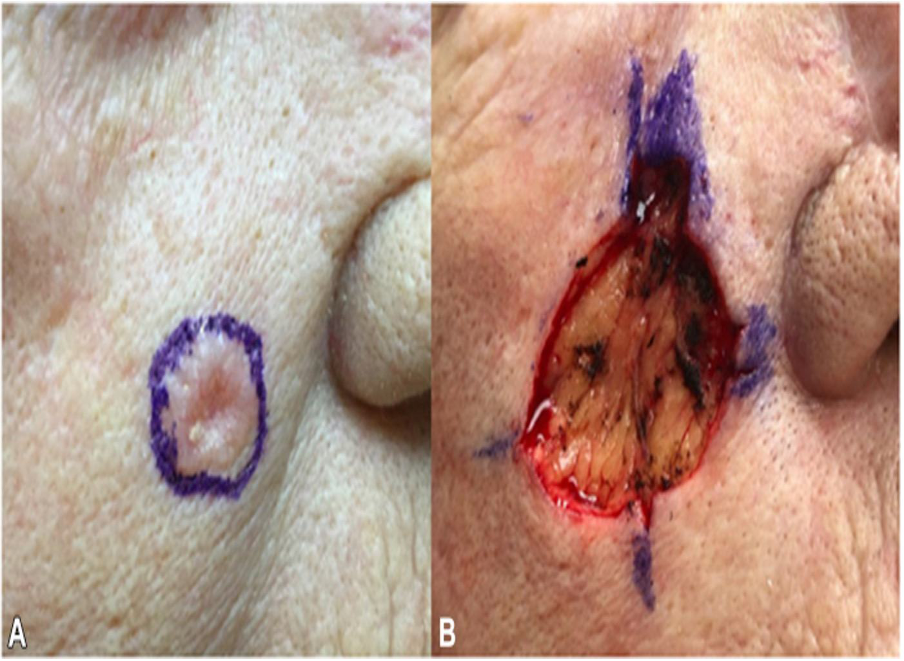

**图 2: Page 2 Img 4**

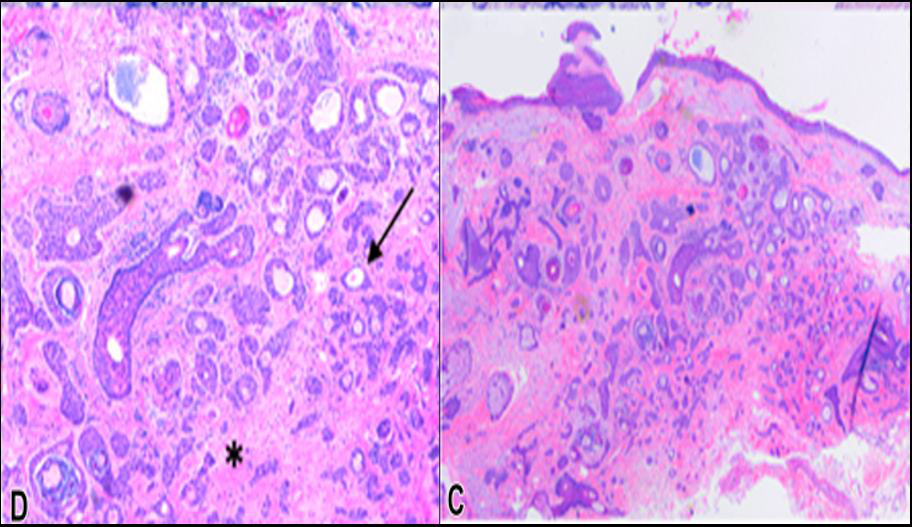

**图 3: Page 2 Img 3**

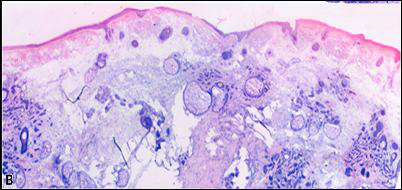

---

### 36. Graph-of-Constraints Model Predictive Control for Reactive Multi-agent Task and Motion Planning

**ArXiv ID**: 2603.18400v1
**作者**: Anastasios Manganaris, Jeremy Lu, Ahmed H. Qureshi, Suresh Jagannathan

**链接**: [PDF](https://arxiv.org/pdf/2603.18400v1) | [Abstract](https://arxiv.org/abs/2603.18400v1)

#### 📄 原文摘要

Sequences of interdependent geometric constraints are central to many multi-agent Task and Motion Planning (TAMP) problems. However, existing methods for handling such constraint sequences struggle with partially ordered tasks and dynamic agent assignments. They typically assume static assignments and cannot adapt when disturbances alter task allocations. To overcome these limitations, we introduce Graph-of-Constraints Model Predictive Control (GoC-MPC), a generalized sequence-of-constraints framework integrated with MPC. GoC-MPC naturally supports partially ordered tasks, dynamic agent coordination, and disturbance recovery. By defining constraints over tracked 3D keypoints, our method robustly solves diverse multi-agent manipulation tasks-coordinating agents and adapting online from visual observations alone, without relying on training data or environment models. Experiments demonstrate that GoC-MPC achieves higher success rates, significantly faster TAMP computation, and shorter overall paths compared to recent baselines, establishing it as an efficient and robust solution for multi-agent manipulation under real-world disturbances. Our supplementary video and code can be found at https://sites.google.com/view/goc-mpc/home .

#### 🌐 中文摘要

相互依赖的几何约束序列是许多多智能体任务和运动规划（TAMP）问题的核心。然而，处理此类约束序列的现有方法难以处理部分有序的任务和动态智能体分配。他们通常假设静态分配，并且当干扰改变任务分配时无法适应。为了克服这些限制，我们引入了约束图模型预测控制（GoC-MPC），这是一种与 MPC 集成的广义约束序列框架。 GoC-MPC 天然支持部分有序任务、动态代理协调和干扰恢复。通过定义对跟踪的 3D 关键点的约束，我们的方法可以稳健地解决各种多智能体操作任务 - 协调智能体并仅根据视觉观察进行在线适应，而无需依赖训练数据或环境模型。 实验表明，与最近的基线相比，GoC-MPC 实现了更高的成功率、显着更快的 TAMP 计算以及更短的总体路径，使其成为现实世界干扰下多智能体操作的高效且稳健的解决方案。我们的补充视频和代码可以在 https://sites.google.com/view/goc-mpc/home 找到。

#### 🏗️ 核心架构

以下为论文中体现核心架构的关键图表：

**图 1: Page 1 Img 1**

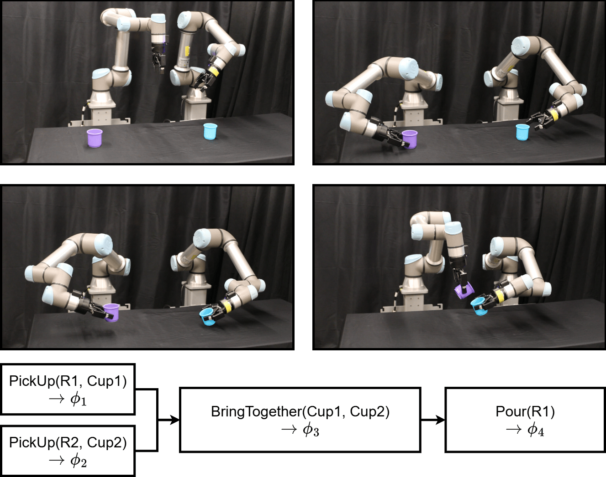

**图 2: Page 6 Img 2**

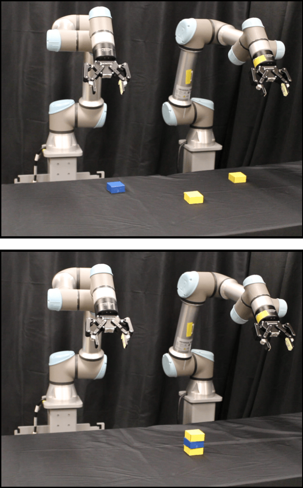

**图 3: Page 7 Img 3**

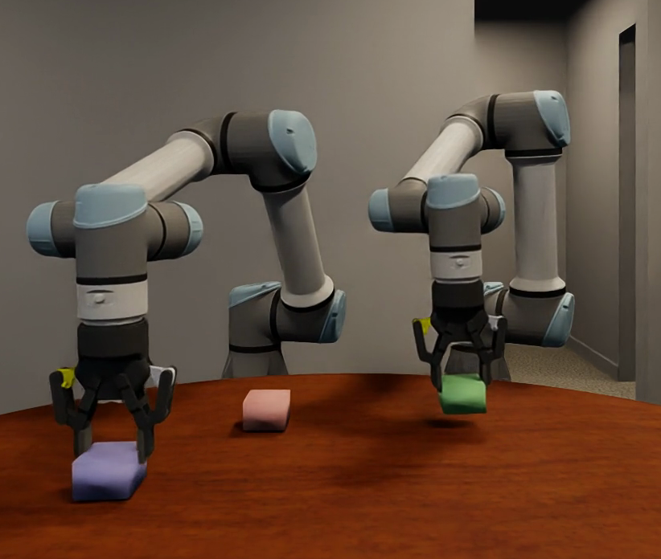

---

### 37. RE-SAC: Disentangling aleatoric and epistemic risks in bus fleet control: A stable and robust ensemble DRL approach

**ArXiv ID**: 2603.18396v1
**作者**: Yifan Zhang, Liang Zheng

**链接**: [PDF](https://arxiv.org/pdf/2603.18396v1) | [Abstract](https://arxiv.org/abs/2603.18396v1)

#### 📄 原文摘要

Bus holding control is challenging due to stochastic traffic and passenger demand. While deep reinforcement learning (DRL) shows promise, standard actor-critic algorithms suffer from Q-value instability in volatile environments. A key source of this instability is the conflation of two distinct uncertainties: aleatoric uncertainty (irreducible noise) and epistemic uncertainty (data insufficiency). Treating these as a single risk leads to value underestimation in noisy states, causing catastrophic policy collapse. We propose a robust ensemble soft actor-critic (RE-SAC) framework to explicitly disentangle these uncertainties. RE-SAC applies Integral Probability Metric (IPM)-based weight regularization to the critic network to hedge against aleatoric risk, providing a smooth analytical lower bound for the robust Bellman operator without expensive inner-loop perturbations. To address epistemic risk, a diversified Q-ensemble penalizes overconfident value estimates in sparsely covered regions. This dual mechanism prevents the ensemble variance from misidentifying noise as a data gap, a failure mode identified in our ablation study. Experiments in a realistic bidirectional bus corridor simulation demonstrate that RE-SAC achieves the highest cumulative reward (approx. -0.4e6) compared to vanilla SAC (-0.55e6). Mahalanobis rareness analysis confirms that RE-SAC reduces Oracle Q-value estimation error by up to 62% in rare out-of-distribution states (MAE of 1647 vs. 4343), demonstrating superior robustness under high traffic variability.

#### 🌐 中文摘要

由于随机交通和乘客需求，公交车等待控制面临挑战。虽然深度强化学习 (DRL) 显示出前景，但标准的行动批评算法在不稳定的环境中会受到 Q 值不稳定的影响。这种不稳定的一个关键根源是两种不同不确定性的合并：任意不确定性（不可减少的噪声）和认知不确定性（数据不足）。将这些视为单一风险会导致在嘈杂国家中价值被低估，从而导致灾难性的政策崩溃。我们提出了一个强大的集成软演员评论家（RE-SAC）框架来明确消除这些不确定性。 RE-SAC 将基于积分概率度量 (IPM) 的权重正则化应用于批评者网络，以对冲任意风险，为稳健的 Bellman 算子提供平滑的分析下界，而无需昂贵的内环扰动。为了解决认知风险，多元化的 Q 集合会惩罚稀疏覆盖区域中过度自信的价值估计。 这种双重机制可以防止集合方差将噪声误识别为数据间隙，这是我们在消融研究中确定的一种故障模式。现实的双向公交走廊模拟实验表明，与普通 SAC (-0.55e6) 相比，RE-SAC 实现了最高的累积奖励 (约 -0.4e6)。 Mahalanobis 稀有性分析证实，RE-SAC 在稀有的分布外状态（MAE 为 1647 与 4343）中将 Oracle Q 值估计误差降低了高达 62%，在高流量变化下展现了卓越的鲁棒性。

---

### 38. Contact Status Recognition and Slip Detection with a Bio-inspired Tactile Hand

**ArXiv ID**: 2603.18370v1
**作者**: Chengxiao He, Wenhui Yang, Hongliang Zhao, Jiacheng Lv, Yuzhe Shao, Longhui Qin

**链接**: [PDF](https://arxiv.org/pdf/2603.18370v1) | [Abstract](https://arxiv.org/abs/2603.18370v1)

#### 📄 原文摘要

Stable and reliable grasp is critical to robotic manipulations especially for fragile and glazed objects, where the grasp force requires precise control as too large force possibly damages the objects while small force leads to slip and fall-off. Although it is assumed the objects to manipulate is grasped firmly in advance, slip detection and timely prevention are necessary for a robot in unstructured and universal environments. In this work, we addressed this issue by utilizing multimodal tactile feedback from a five-fingered bio-inspired hand. Motivated by human hands, the tactile sensing elements were distributed and embedded into the soft skin of robotic hand, forming 24 tactile channels in total. Different from the threshold method that was widely employed in most existing works, we converted the slip detection problem to contact status recognition in combination with binning technique first and then detected the slip onset time according to the recognition results. After the 24-channel tactile signals passed through discrete wavelet transform, 17 features were extracted from different time and frequency bands. With the optimal 120 features employed for status recognition, the test accuracy reached 96.39% across three different sliding speeds and six kinds of materials. When applied to four new unseen materials, a high accuracy of 91.95% was still achieved, which further validated the generalization of our proposed method. Finally, the performance of slip detection is verified based on the trained model of contact status recognition.

#### 🌐 中文摘要

稳定可靠的抓取对于机器人的操作至关重要，特别是对于易碎和有光泽的物体，抓取力需要精确控制，太大的力可能会损坏物体，而小力会导致滑倒和掉落。虽然假设要操作的物体是预先牢牢抓住的，但对于非结构化和通用环境中的机器人来说，滑动检测和及时预防是必要的。在这项工作中，我们通过利用五指仿生手的多模式触觉反馈来解决这个问题。在人手的激励下，触觉传感元件分布并嵌入机器人手的柔软皮肤中，总共形成24个触觉通道。与大多数现有工作中广泛采用的阈值方法不同，我们首先结合分箱技术将滑动检测问题转化为接触状态识别，然后根据识别结果检测滑动发生时间。 24通道触觉信号经过离散小波变换后，提取不同时间和频段的17个特征，并采用最优的120个特征进行状态识别，在3种不同的滑动速度和6种材料上，测试准确率达到96.39%。当应用于四种新的看不见的材料时，仍然达到了 91.95% 的高精度，这进一步验证了我们提出的方法的泛化性。最后，基于训练好的接触状态识别模型验证了滑动检测的性能。

#### 🏗️ 核心架构

以下为论文中体现核心架构的关键图表：

**图 1: Page 3 Img 3**

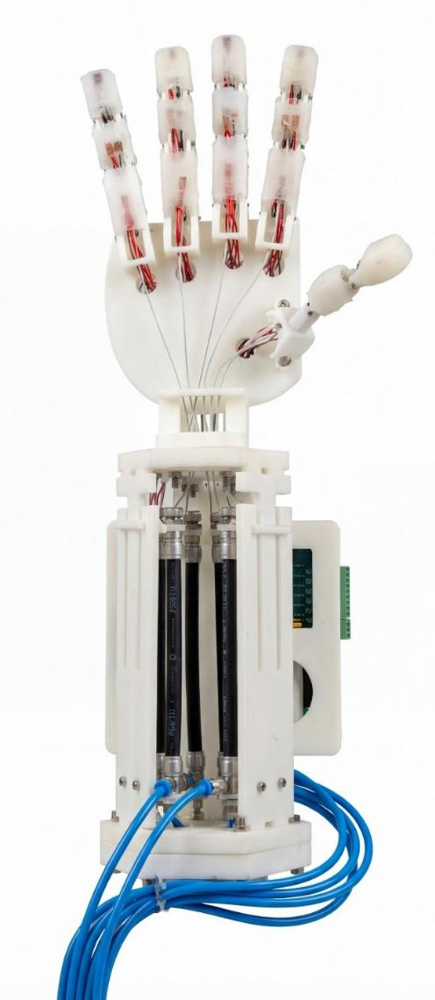

**图 2: Page 3 Img 2**

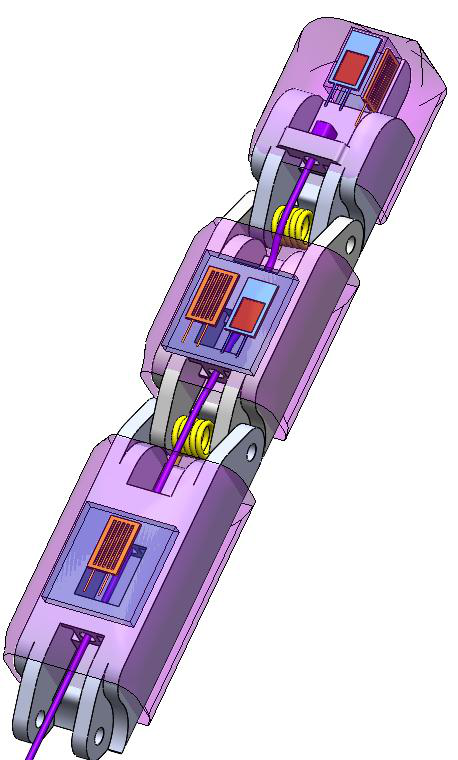

**图 3: Page 3 Img 15**

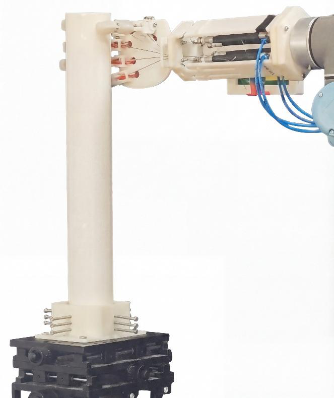

---

### 39. PowerFlow: Unlocking the Dual Nature of LLMs via Principled Distribution Matching

**ArXiv ID**: 2603.18363v1
**作者**: Ruishuo Chen, Yu Chen, Zhuoran Li, Longbo Huang

**链接**: [PDF](https://arxiv.org/pdf/2603.18363v1) | [Abstract](https://arxiv.org/abs/2603.18363v1)

#### 📄 原文摘要

Unsupervised Reinforcement Learning from Internal Feedback (RLIF) has emerged as a promising paradigm for eliciting the latent capabilities of Large Language Models (LLMs) without external supervision. However, current methods rely on heuristic intrinsic rewards, which often lack a well-defined theoretical optimization target and are prone to degenerative biases. In this work, we introduce PowerFlow, a principled framework that reformulates unsupervised fine-tuning as a distribution matching problem. By casting GFlowNet as an amortized variational sampler for unnormalized densities, we propose a length-aware Trajectory-Balance objective that explicitly neutralizes the structural length biases inherent in autoregressive generation. By targeting $α$-power distributions, PowerFlow enables the directional elicitation of the dual nature of LLMs: sharpening the distribution ($α> 1$) to intensify logical reasoning, or flattening it ($α< 1$) to unlock expressive creativity. Extensive experiments demonstrate that PowerFlow consistently outperforms existing RLIF methods, matching or even exceeding supervised GRPO. Furthermore, by mitigating over-sharpening in aligned models, our approach achieves simultaneous gains in diversity and quality, shifting the Pareto frontier in creative tasks.

#### 🌐 中文摘要

来自内部反馈的无监督强化学习（RLIF）已成为一种有前景的范式，可以在没有外部监督的情况下激发大型语言模型（LLM）的潜在能力。然而，当前的方法依赖于启发式内在奖励，而这种奖励通常缺乏明确定义的理论优化目标，并且容易出现退化偏差。在这项工作中，我们介绍了 PowerFlow，这是一个原则框架，它将无监督微调重新表述为分布匹配问题。通过将 GFlowNet 转换为非归一化密度的摊销变分采样器，我们提出了一个长度感知的轨迹平衡目标，该目标明确地中和了自回归生成中固有的结构长度偏差。通过瞄准 $α$ 权力分布，PowerFlow 能够定向引发法学硕士的双重性质：锐化分布 ($α> 1$) 以强化逻辑推理，或扁平化分布 ($α< 1$) 以释放表达创造力。 大量实验表明，PowerFlow 始终优于现有 RLIF 方法，匹配甚至超过有监督的 GRPO。此外，通过减轻对齐模型中的过度锐化，我们的方法实现了多样性和质量的同步增益，从而改变了创造性任务中的帕累托前沿。

---
